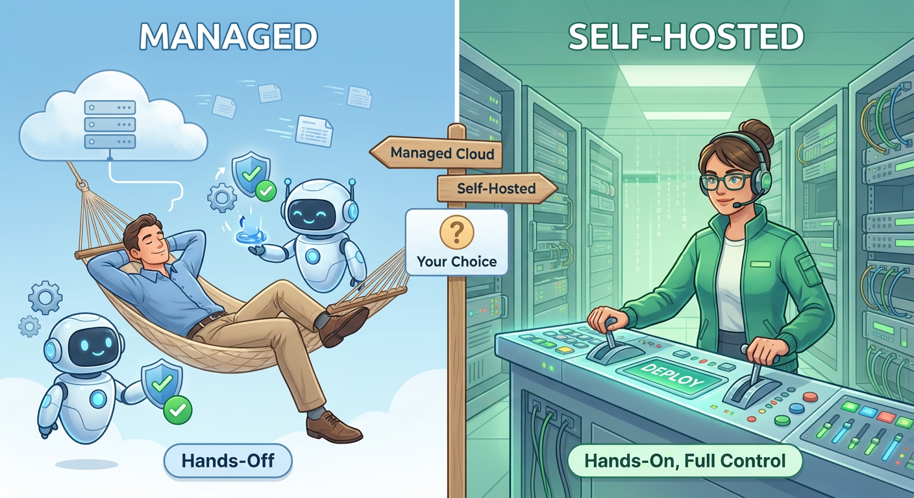

# Whitepaper BiziX

## Cuprins

- [Capitolul 1: Introducere – O Nouă Paradigmă: Automatizarea Asistată](#capitolul-1)
- [Capitolul 2: Prezentare Generală – Arhitectura pe 4 Piloni a BiziX](#capitolul-2)
- [Capitolul 3: Arhitectura Încrederii – Blockchain-ul ca Notar Invizibil](#capitolul-3)
- [Capitolul 4: Ecosistemul BiziX – De la "One-Click" la Libertate pentru Developeri](#capitolul-4)
- [Capitolul 5: Principiile Guvernanței – Evoluție prin Vocea Comunității](#capitolul-5)
- [Capitolul 6: BiziX în Acțiune – Procese de Business ca Serviciu (BPaaS)](#capitolul-6)
- [Capitolul 7: Foaia de Parcurs Strategică](#capitolul-7)
- [Capitolul 8: BiziX AI – Asistentul Tău Privat (Human-in-the-Loop)](#capitolul-8)
- [Capitolul 9: Arhitecții Viziunii](#capitolul-9)
- [Capitolul 10: Model Economic și Tokenomics BIZ](#capitolul-10)
- [Capitolul 11: Programul de Ambasadori BiziX](#capitolul-11)
- [Capitolul 12: Riscuri și Avertismente](#capitolul-12)
- [Capitolul 13: Concluzia](#capitolul-13)
- [Glosar de Termeni](#glosar)
- [Întrebări Frecvente (FAQ)](#faq)

## Capitolul 1: Introducere – O Nouă Paradigmă: Automatizarea Asistată

### BiziX în 60 de secunde

Imaginează-ți că ești antreprenor. Ai o frizerie, o cafenea, un atelier de reparații. Știi că ai nevoie de un site, de un sistem de programări, poate de un CRM — dar nu știi de unde să începi, nu ai timp să compari zeci de soluții și nu-ți permiți să angajezi un consultant IT.

BiziX rezolvă exact asta.

**Pentru antreprenori:** O singură platformă unde găsești toate uneltele digitale de care ai nevoie — site, programări, facturare, CRM — pregătite să funcționeze în câteva minute, nu săptămâni.

**Pentru cei care îi cunosc pe antreprenori:** Contabilii, consultanții, mentorii care deja au relații de încredere cu acești oameni pot deveni Ambasadori BiziX. Le recomandă soluții, îi ghidează, și sunt recompensați pentru valoarea pe care o aduc — cu comisioane recurente, plătite automat și transparent.

**Pentru dezvoltatori:** O piață deschisă unde pot crea aplicații și le pot monetiza, ajungând direct la antreprenorii care au nevoie de ele.

Totul funcționează pe o fundație de încredere verificabilă — fiecare tranzacție, fiecare comision, fiecare acord poate fi verificat matematic, nu doar promis.

---

### Puncte Cheie

- **Blockchain descentralizat** cu validatori independenți și ancorare publică pentru verificabilitate externă
- **Token utilitar BIZ** pentru acces la servicii și participare în governance (nu stablecoin)
- **Mecanism anti-speculație** cu burn pe utilizare și utilitate reală obligatorie
- **Conformitate MiCA** prin design — token utilitar în sensul Regulamentului UE 2023/1114
- **Open-source** pentru transparență și audit independent

---

### 🛡️ Protecție Anti-Speculație (Rezumat)

BiziX implementează 5 mecanisme pentru a descuraja speculația și a încuraja utilizarea reală:

1. **20% burn** pe fiecare plată în BIZ — reducere permanentă a supply-ului
2. **Staking lock-up** cu recompense crescătoare pentru angajament pe termen lung
3. **Vesting 4+ ani** pentru echipă și insideri — fără dump-uri la lansare
4. **Buyback trimestrial** din profitul operațional — cerere organică legată de succes
5. **Funcții premium** disponibile exclusiv cu BIZ — utilitate reală obligatorie

*Detalii complete în [Capitolul 10: Tokenomics](#capitolul-10).*

---

### Cum Funcționează BiziX — Vedere de Ansamblu

*Diagrama 1: Fluxul principal — de la problemă la soluție*

---

### Credința Noastră Fundamentală

> **Credem că orice antreprenor merită acces la unelte digitale simple, fără să fie nevoit să fie programator sau să aibă buget de corporație. Și credem că oamenii care îi cunosc pe acești antreprenori sunt cei mai buni să-i ghideze către soluții.**

Aceasta nu este doar o declarație de marketing. Este principiul după care am construit fiecare decizie în BiziX — de la arhitectura tehnică până la modelul de business.

---

### Contextul: De ce e nevoie de BiziX

Lumea modernă a afacerilor operează la o viteză fără precedent, însă uneltele digitale au rămas în urmă. Astăzi, antreprenorii se luptă cu un peisaj fragmentat: date izolate în aplicații incompatibile, muncă manuală repetitivă și o lipsă acută de încredere în parteneriatele digitale.

BiziX a fost conceput ca răspuns la această realitate, dar cu o abordare fundamental diferită. **Nu ne propunem să înlocuim factorul uman cu roboți autonomi, ci să împuternicim antreprenorul prin tehnologie.**

> **BiziX transformă ore de birocrație în secunde de decizie.**

### Misiunea Noastră

Să oferim IMM-urilor infrastructura digitală care le permite să opereze cu eficiența unei corporații, dar cu agilitatea unui startup.

Facem acest lucru printr-o platformă unificată de tip **BPaaS (Business Process as a Service)**, care abordează direct cele mai presante probleme:

1. **Productivitate Multiplicată:** Prin integrarea aplicațiilor cu un strat de AI local, eliminăm munca de rutină (introducere date, triere emailuri). BiziX pregătește munca, tu doar o validezi.

2. **Securitate și Integritate:** Într-o eră a incertitudinii, folosim blockchain-ul ca pe un strat invizibil de audit, garantând matematic integritatea contractelor și a operațiunilor.

3. **Control Total:** Oferim o platformă deschisă, unde datele îți aparțin, iar accesul tehnic poate merge până la nivel de server (SSH), eliminând riscul de "Vendor Lock-in".

### Viziunea: Automatizarea Asistată (Human-in-the-Loop)

Viziunea noastră este pragmatică: credem în **Automatizarea Asistată**. Aceasta înseamnă că AI-ul și automatizările nu iau decizii în locul tău — ele pregătesc, propun și așteaptă confirmarea ta.

- **AI-ul propune:** redactează emailuri, clasifică tranzacții, extrage date din facturi.
- **Sistemul așteaptă:** acțiunile sunt salvate ca "Ciornă".
- **Tu decizi:** revizuiești și dai "Bun de tipar".

Această abordare îți oferă viteza automatizării (de 10x mai rapid), dar păstrează discernământul și responsabilitatea umană. **Tu decizi, el execută.**

### Obiective de Lansare

În prima etapă vom livra pachetele BiziX folosind exclusiv aplicații selectate și administrate de echipa noastră internă. Vom valida modelul împreună cu primii 100 de clienți plătitori, înainte de a deschide marketplace-ul pentru parteneri externi.

## Capitolul 2: Prezentare Generală – Arhitectura pe 4 Piloni a BiziX

BiziX nu este o simplă colecție de aplicații, ci un ecosistem coerent construit pe **patru piloni tehnologici** care lucrează în sinergie perfectă. Fiecare pilon are un rol specific, iar împreună creează o platformă care depășește suma părților sale componente.

### Pilonul 1: Fundația Operațională (Aplicațiile)

La bază, BiziX elimină fragmentarea și ineficiența, oferind o suită
robustă de aplicații de business esențiale. Acestea sunt proiectate să
funcționeze în perfectă sinergie, eliminând silozurile de date și nevoia
de a gestiona multiple abonamente și integrări complexe.

- **Management Integrat al Afacerii (ERP):** Centralizați procesele de
  bază -- de la finanțe și resurse umane la producție și lanț de
  aprovizionare -- fără costurile și complexitatea sistemelor enterprise
  tradiționale.

- **Managementul Relațiilor cu Clienții (CRM):** Construiți și
  consolidați relații durabile cu clienții prin gestionarea eficientă a
  datelor și personalizarea interacțiunilor.

- **Management de Proiect:** Planificați, executați și monitorizați
  proiecte cu instrumente colaborative și vizibilitate în timp real
  asupra progresului.

- **Resurse Umane (HR):** Simplificați întregul ciclu de viață al
  angajaților, de la recrutare și onboarding la managementul
  performanței și salarizare.

- **Management Financiar:** Obțineți control total asupra finanțelor cu
  instrumente complete pentru contabilitate, bugetare și raportare.

- Pachetele disponibile la lansare.

> Pentru a reduce timpul de adoptare, oferim 5 bundle-uri
> preconfigurate:

| Pachet | Aplicații incluse | Probleme rezolvate |
|--------|-------------------|-------------------|
| Start (prezență) | WordPress, Matomo, Contact Form | Site rapid, analytics GDPR |
| Vinde Online | WordPress + WooCommerce, Netopia/PayU, Mautic | E-commerce la cheie, campanii automate |
| Servicii & Programări | EasyAppointments, Chatwoot, Matomo | Programări online + suport omnichannel |
| B2B Simplu | EspoCRM, osTicket, Mautic | Pipeline vânzări, suport clienți, nurturing |
| Birou Digital | Nextcloud, Outline, Matomo | Colaborare, know-how, back-up centralizat |

> **Toate pachetele includ 30 de zile gratuite pentru testare, fără obligații.**

Această abordare integrată creează o **singură sursă de adevăr (Single
Source of Truth)** pentru întreaga afacere, asigurând coerența datelor
și eficiența decizională.

### Pilonul 2: Stratul de Performanță (Cloud Privat)

Aplicațiile de bază (ERP, CRM etc.) rulează pe o infrastructură de cloud privat, securizată și ultra-performantă, bazată pe **Proxmox VE**. Această alegere strategică asigură:

- **Viteza în timp real** — operațiunile zilnice nu au lag
- **Disponibilitate ridicată** — uptime >99% garantat
- **Izolarea datelor** — fiecare client are propriul mediu izolat
- **Backup zilnic automat** — toate datele sunt salvate automat în fiecare noapte, cu retenție de 30 de zile (aceasta nu este o opțiune, ci o garanție inclusă pentru toți clienții)
- **Securitate enterprise** — datele sunt criptate și protejate conform celor mai înalte standarde

### Pilonul 3: Stratul de Orchestrare (Integration Engine)

Acesta este **"creierul" invizibil** al platformei — elementul care diferențiază BiziX de o simplă colecție de aplicații.

Folosind un motor de integrare avansat (bazat pe **n8n**), BiziX conectează aplicațiile între ele și automatizează fluxurile de lucru. Iată ce înseamnă asta în practică:

- Un mesaj primit în **Chatwoot** poate genera automat o ciornă de factură în **ERP**
- O factură încărcată în **Nextcloud** este procesată de AI și introdusă automat ca "Ciornă" în contabilitate
- O comandă finalizată în **WooCommerce** declanșează actualizarea stocului și notificarea curierului

**Acest strat asigură fluxul continuu al datelor fără intervenție manuală.** Aplicațiile nu mai sunt silozuri separate — devin un organism unitar care respiră în același ritm.

### Pilonul 4: Stratul de Încredere (Blockchain)

Folosim tehnologia blockchain nu pentru a stoca date, ci ca un **Notar Digital Invizibil** — invizibil pentru utilizator, dar indispensabil pentru siguranța afacerii. Pentru evenimentele critice, platforma generează automat o "amprentă" criptografică imutabilă.

*(Detalii complete în [Capitolul 3: Arhitectura Încrederii](#capitolul-3))*

Acest model pe 4 piloni asigură că BiziX este suficient de rapid și scalabil pentru operațiuni complexe, dar și fundamental securizat de un strat de încredere verificabil matematic.

*Diagrama 2: Arhitectura pe 4 piloni — de la aplicații la blockchain*

### Diferențiatorul BiziX: De ce Depășim SaaS-ul Tradițional

În timp ce platforme precum Zoho oferă suite de aplicații, acestea
operează pe o arhitectură centralizată, lipsită de garanțiile native ale
tehnologiei blockchain. BiziX se distinge fundamental prin:

- **Integritate Garantată Matematic:** Spre deosebire de bazele de date
  tradiționale, care pot fi modificate de administratori, înregistrările
  noastre ancorate pe blockchain sunt inviolabile.

- **Transparență Verificabilă:** Oferim un nivel superior de
  transparență și responsabilitate, esențial în colaborările dintre mai
  multe părți interesate.

- **Reducerea Sistemică a Riscului de Fraudă:** Caracterul imutabil al
  blockchain-ului descurajează fundamental activitățile frauduloase.

- **Colaborare de tip "Trustless":** Platforma permite colaborarea
  sigură între entități care nu au o relație de încredere preexistentă,
  deoarece regulile sunt aplicate de cod (contracte inteligente), nu de
  un intermediar.

**Matrice comparativă:**

| Caracteristică | BiziX | Zoho | Alte platforme SaaS tradiționale |
|----------------|-------|------|----------------------------------|
| Integrare Blockchain | Da (securitate, transparență, automatizare) | Nu | Nu |
| Ecosistem deschis | Da (piață, API-uri, SDK-uri) | Limitat | Limitat |
| Guvernanță democratică | Da (vot pe bază de token-uri) | Nu | Nu |
| Utilitatea token-urilor | Da (acces la servicii, guvernanță etc.) | Nu | Nu |
| Scalabilitate | Ridicată, prin cloud privat scalabil cu verificare blockchain | Scalabilitate tradițională | Scalabilitate tradițională |
| Personalizare | Ridicată, prin API-uri și SDK-uri | Personalizare standard | Personalizare standard |

În esență, BiziX reprezintă evoluția naturală a software-ului de
business. Prin arhitectura sa hibridă unică, platforma oferă nu doar un
set de unelte operaționale, ci și un fundament de încredere și
securitate. Am demonstrat cum modelul nostru integrează performanța unui
cloud privat cu integritatea imutabilă a blockchain-ului, creând o
soluție superioară platformelor tradiționale.

### Casele Platformei: Unde Trăiește Fiecare Participant

Fiecare participant în ecosistemul BiziX are propria "casă" — un spațiu dedicat, optimizat pentru nevoile sale specifice:

| Adresă | Pentru cine | Ce găsești acolo |
|--------|-------------|------------------|
| **www.bizix.ro** | Toată lumea | Poarta de intrare — marketplace-ul public cu toate aplicațiile disponibile |
| **client.bizix.ro** | Antreprenori | Dashboard-ul afacerii — aplicațiile active, facturi, setări, suport |
| **ambasador.bizix.ro** | Ambasadori | Centru de comandă — clienți recomandați, comisioane, pagină personalizabilă de prezentare |
| **devs.bizix.ro** | Dezvoltatori | Portal tehnic — documentație API, SDK-uri, statistici aplicații, revenue |
| **explorer.bizix.ro** | Oricine | Transparență blockchain — verifică orice tranzacție, comision sau acord |
| **wallet.bizix.ro** | Utilizatori BIZ | Portofel — sold, istoric tranzacții, conversie RON ↔ BIZ |

Această separare nu este doar organizatorică — fiecare interfață este construită specific pentru contextul utilizatorului. Un ambasador nu trebuie să navigheze prin setări tehnice; un dezvoltator nu trebuie să vadă informații despre comisioane de recomandare.

*Diagrama 3: Fiecare participant are propria "casă" în ecosistem*

Următorul capitol va explora în detaliu mecanismele prin care stratul
blockchain devine fundamentul încrederii și eficienței în ecosistemul
BiziX.

## Capitolul 3: Arhitectura Încrederii – Blockchain-ul ca Notar Invizibil

Strategia noastră este să facem tehnologia blockchain **invizibilă pentru utilizator, dar indispensabilă pentru siguranța afacerii**.

Lanțul BiziX este construit pe framework-ul Substrate, într-o
configurație solo-chain scrisă în Rust, ceea ce ne permite să controlăm
complet runtime-ul, upgrade-urile și instrumentele de audit. Această
arhitectură ne oferă performanțe predictibile și posibilitatea de a
ancora înregistrările critice prin hash-uri imutabile.

### 1. Registrul Imutabil: Notarul Digital Invizibil

Strategia noastră nu este să rulăm întreaga platformă pe un blockchain,
ceea ce ar compromite performanța, ci să folosim cea mai puternică
proprietate a sa: imutabilitatea. BiziX utilizează blockchain-ul ca un
registru universal de verificare — un notar digital care funcționează
24/7, fără să știi că există.

**Cum funcționează:**

Procesul este elegant și eficient. Pentru fiecare eveniment critic --
semnarea unui contract, aprobarea unei facturi, finalizarea unei etape
în lanțul de aprovizionare -- platforma BiziX generează o "amprentă"
criptografică unică (hash) a datelor relevante. Această amprentă, care
nu conține date sensibile, este înregistrată ca o tranzacție pe
blockchain.

**Rezultatul este un lanț de dovezi incoruptibil și ștampilat temporal,
care oferă beneficii concrete:**

- **Auditabilitate Absolută:** Auditurile devin simple și fiabile.
  Părțile interesate pot demonstra matematic integritatea oricărei
  înregistrări istorice, comparând hash-ul datelor actuale cu cel
  înregistrat permanent pe blockchain.

- **Soluționare Rapidă a Disputelor:** Neînțelegerile contractuale sau
  operaționale sunt soluționate rapid, făcând referire la înregistrarea
  obiectivă și de necontestat de pe blockchain.

- **Securitate Sistemică:** Pe lângă protocoalele de securitate ale
  cloud-ului privat, stratul blockchain oferă o a doua linie de apărare,
  descentralizată, care face orice tentativă de manipulare a datelor
  detectabilă instantaneu.

### Protecție împotriva Administratorului: "Glass Box"

Într-un sistem tradițional, trebuie să ai încredere că administratorul platformei nu modifică datele. Cu BiziX, această încredere devine inutilă.

> **Odată scris pe blockchain, nici chiar echipa BiziX nu poate modifica retroactiv o înregistrare.**

Aceasta este garanția supremă de integritate — ceea ce numim modelul **"Glass Box"** (Cutia de Sticlă). Spre deosebire de "cutia neagră" tradițională, unde nu știi ce se întâmplă în interior, BiziX oferă transparență totală:

- **Verificabilitate matematică** — Nu ne cere să ne crezi pe cuvânt; verifică pe explorer.bizix.ro
- **Imutabilitate garantată** — Codul, nu oamenii, aplică regulile
- **Audit în timp real** — Oricine poate vedea orice tranzacție, oricând

Aceasta este diferența fundamentală față de orice platformă SaaS tradițională: **nu promisiuni, ci dovezi matematice.**

*Diagrama 4: Cum funcționează notarizarea — de la document la dovadă imutabilă*

### 5. BiziX Chain — Arhitectura Descentralizată

#### Filosofia Descentralizării

BiziX Chain este construit pe principiul descentralizării progresive. Recunoaștem că descentralizarea completă din prima zi nu este practică, dar arhitectura permite și încurajează tranziția către un sistem complet descentralizat.

#### Modelul de Descentralizare în 3 Faze

**Faza 1 — Genesis (Lunile 1-6)**

Caracteristici:
- BiziX operează 3 noduri validator în locații geografice diferite
- Codul blockchain-ului este open-source pe GitHub
- Oricine poate rula un nod full (read-only) pentru verificare
- Ancorare zilnică pe Polygon PoS pentru verificabilitate externă

Garanții oferite:
- Transparență completă a codului
- Verificabilitate externă prin anchoring public
- Pregătire tehnică pentru validatori externi

**Faza 2 — Descentralizare Parțială (Lunile 6-12)**

Caracteristici:
- Minimum 5 validatori externi activi
- BiziX deține sub 50% din puterea de vot
- Consensul necesită 67% din validatori
- Primul audit de securitate extern

Cine poate deveni validator:
- Firme de contabilitate și audit
- Parteneri strategici verificați
- Clienți enterprise cu infrastructură proprie

**Faza 3 — Descentralizare Completă (12+ luni)**

Caracteristici:
- Minimum 21 validatori activi
- BiziX deține sub 15% din puterea de vot
- Governance complet on-chain
- Oricine poate deveni validator prin staking

#### Garanții Criptografice

Indiferent de faza de descentralizare, oferim:

1. **Anchoring Public**
   Hash-ul complet al lanțului este publicat zilnic pe Polygon PoS.
   Oricine poate verifica că lanțul local corespunde cu ancora publică.

2. **Merkle Proofs**
   Fiecare utilizator poate genera dovada criptografică independentă
   că tranzacția sa există în lanț și nu a fost modificată.

3. **Cod Open-Source**
   Implementarea completă este disponibilă public pentru audit.
   Licență: Apache 2.0

4. **Immutabilitate Verificabilă**
   Structura blockchain-ului face imposibilă modificarea retroactivă
   a datelor fără detectare imediată de către toți participanții.

#### De Ce Blockchain Propriu vs. Ethereum/Polygon Direct

| Criteriu | Ethereum L2 | BiziX Chain |
|----------|-------------|-------------|
| Cost per tranzacție | $0.01-0.10 | < $0.001 |
| Confidențialitate | Date publice | Date criptate, doar hash-uri publice |
| Throughput | ~100-1000 TPS | 10.000+ TPS |
| Conformitate GDPR | Problematică | Nativă prin design |
| Control upgrade-uri | Dependent de L1 | Guvernat de comunitate |

BiziX Chain este optimizat specific pentru date de business confidențiale, cu ancorare pe chain-uri publice pentru verificabilitate externă.

*Diagrama 5: Cele 3 faze ale descentralizării — de la Genesis la autonomie completă*

### 6. Specificații Tehnice BiziX Chain

#### Parametri de Bază

| Parametru | Valoare |
|-----------|---------|
| Timp bloc | 2 secunde |
| Dimensiune maximă bloc | 5 MB |
| Tranzacții per bloc | ~2.500 |
| Throughput maxim | ~10.000 TPS |
| Finalitate | 2 blocuri (~4 secunde) |
| Algoritm hash | SHA-256 (date) + Keccak-256 (adrese) |
| Criptare date | AES-256-GCM |
| Semnături | Ed25519 |

#### Mecanismul de Consens: Delegated Proof of Stake (DPoS)

**Cum funcționează:**

1. Utilizatorii stake-ează BIZ și pot delega către validatori
2. Top N validatori (inițial N=21) produc blocuri în round-robin
3. Fiecare validator are o fereastră de 2 secunde pentru a produce bloc
4. Blocul este valid dacă este semnat de validatorul desemnat
5. Finalitatea este atinsă când 67% din validatori confirmă blocul

**Cerințe Validator:**

| Cerință | Minim |
|---------|-------|
| Stake BIZ | 10.000 BIZ |
| Hardware | 4 CPU, 16GB RAM, 500GB SSD NVMe |
| Bandwidth | 100 Mbps simetric |
| Uptime | 99% |
| Locație | IP fix, acces 24/7 |

**Sistem de Recompense și Penalizări:**

Recompense:
- 70% din taxele de tranzacție → distribuite proporțional
- Bonus pentru uptime > 99.9%

Penalizări (Slashing):
- Downtime > 1 oră: 1% din stake
- Downtime > 24 ore: 5% din stake
- Double-signing (tentativă fraudă): 100% din stake
- Comportament malițios dovedit: 100% din stake + ban permanent

#### Tipuri de Noduri

| Tip Nod | Funcție | Cerințe | Recompense |
|---------|---------|---------|------------|
| Validator | Produce blocuri, votează | Stake + hardware | Da |
| Full Node | Verifică și stochează tot | Hardware | Nu |
| Light Node | Verifică header-e | Minimal | Nu |
| Archive Node | Stochează istoric complet | Storage mare | Nu |

### 2. Smart Contracts: Logica de Business Devenită Cod Imutabil

Dacă registrul imutabil este memoria de neșters a platformei,
contractele inteligente (smart contracts) sunt voința sa autonomă.
Acestea sunt programe care rulează pe blockchain și execută automat
acțiuni predefinite atunci când anumite condiții sunt îndeplinite.
Astfel, eliminăm nevoia de intermediari și garantăm execuția corectă a
proceselor.

**Implementări cheie în BiziX:**

- **Plăți Garantate și Instantanee:** Programele noastre de Ambasadori
  și Marketplace pentru Dezvoltatori sunt guvernate de contracte
  inteligente. Când un client plătește un abonament, contractul
  calculează și distribuie automat și instantaneu comisionul corect, în
  token-uri BIZ, către ambasador sau dezvoltator. Procesul este
  transparent și elimină complet disputele.

- **Servicii Escrow Automatizate:** Pentru proiecte sau tranzacții
  complexe, fondurile pot fi blocate într-un contract inteligent.
  Acestea sunt eliberate automat către furnizor doar după ce etapele de
  livrare sunt confirmate on-chain de ambele părți, eliminând riscul de
  neplată.

- **Automatizări în Lanțul de Aprovizionare:** Un contract inteligent
  poate declanșa automat o plată către un furnizor imediat ce sistemul
  confirmă recepția bunurilor, eficientizând radical fluxurile de
  achiziții.

### 3. Tokenizarea: Motorul Economic al Ecosistemului

Tokenul BIZ este elementul vital care alimentează economia platformei.
Utilitatea sa este impusă și garantată de logica blockchain, asigurând
roluri specifice și verificabile:

- **Guvernanță Descentralizată și Transparentă:** Fiecare token BIZ
  conferă putere de vot. Propunerile de dezvoltare a platformei sunt
  supuse la vot printr-un contract inteligent, care numără voturile în
  mod transparent și incoruptibil.

- **Mecanisme de Recompensare Programatice:** Programe precum Bug Bounty
  sunt gestionate prin contracte inteligente. Acestea permit echipei să
  declanșeze plăți de recompense în BIZ către cercetătorii în securitate
  imediat după validarea unei vulnerabilități, într-un mod rapid și
  verificabil.

- **Controlul Accesului Bazat pe Utilitate:** Accesul la funcționalități
  premium sau API-uri avansate poate fi condiționat de deținerea unei
  anumite cantități de token-uri BIZ. Platforma verifică on-chain și în
  timp real deținerea token-urilor pentru a acorda acces, creând un sistem
  de privilegii automatizat și transparent.

### 4. AI Trust Layer: Vârful de Lance al Inovației BiziX

Cea mai puternică sinergie din arhitectura noastră este cea dintre
Inteligența Artificială și Blockchain. Una dintre cele mai mari bariere
în adoptarea AI în funcții critice de business este lipsa de
transparență -- faimoasa problemă a "cutiei negre". BiziX rezolvă
această problemă fundamentală prin **AI Trust Layer**.

Când sistemul nostru AI generează o analiză strategică (o prognoză
financiară, o recomandare operațională), platforma creează o
"amprentă" criptografică a întregului proces. Aceasta conține hash-ul
datelor de intrare, identificatorul modelului AI folosit și hash-ul
rezultatului generat. Această amprentă este apoi ancorată pe blockchain.

**Acest mecanism transformă "cutia neagră" a inteligenței artificiale
într-o "cutie de sticlă" complet auditabilă.** Orice parte interesată
poate verifica matematic, oricând, pe ce date și pe ce versiune de model
s-a bazat o anumită decizie AI. Acest lucru oferă un nivel fără
precedent de responsabilitate și încredere, esențial pentru adoptarea AI
în decizii cu miză mare.

Pentru a păstra auditul perfect, fiecare inferență AI stochează metadate
în lanțul Substrate (hash-ul datelor de intrare, versiunea modelului,
timestamp). Prin rotația periodică a cheilor JWT (automatizată și
documentată în runbook-uri), eliminăm riscul de acces neautorizat la
stratul AI.

*Diagrama 6: AI Trust Layer — cum devine AI-ul auditabil prin blockchain*

## Capitolul 4: Ecosistemul BiziX – De la "One-Click" la Libertate pentru Developeri {#capitolul-4}

BiziX este conceput să crească odată cu afacerea ta, oferind **flexibilitate totală** — de la simplitatea "one-click" pentru antreprenori până la acces root pentru dezvoltatori.

Credem cu tărie că inovația accelerată nu provine de la o singură entitate, ci din inteligența colectivă a unei comunități motivate. De aceea, am construit o platformă care nu doar oferă unelte, ci și încurajează activ participarea, stimulează contribuțiile și aliniază interesele tuturor membrilor.

Filosofia noastră este simplă: succesul platformei este succesul
comunității. Acest capitol detaliază pilonii care susțin acest ecosistem
dinamic și modul în care fiecare componentă generează valoare reciprocă.

### Cele Patru Triburi: Un Ecosistem cu Interese Aliniate

BiziX funcționează pentru că reunește patru tipuri de participanți, fiecare cu un rol distinct, dar cu interese perfect aliniate. Când antreprenorul prosperă, toți câștigă.

| Trib | Ce oferă ecosistemului | Ce primește în schimb |
|------|------------------------|----------------------|
| **Antreprenorul** | Banii și încrederea sa | Unelte digitale simple, fără complexitate tehnică |
| **Ambasadorul** | Relații existente și ghidaj | Comision recurent pentru fiecare client activ |
| **Dezvoltatorul** | Aplicații și integrări | Revenue share recurent din abonamente |
| **BiziX** | Platforma, infrastructura, orchestrarea | Procent din tranzacții |

**De ce funcționează acest model:**

- **Antreprenorul** nu mai trebuie să caute singur soluții sau să se bazeze pe reclame — primește recomandări de la oameni în care are deja încredere.
- **Ambasadorul** (contabilul, consultantul, mentorul) poate în sfârșit să ajute concret clienții cu care lucrează de ani de zile, fiind recompensat pentru valoarea pe care o aduce.
- **Dezvoltatorul** are acces direct la o piață de antreprenori cu nevoi reale, fără să cheltuie pe marketing.
- **BiziX** crește organic, prin relații autentice, nu prin publicitate agresivă.

Aceasta nu este doar o structură de business — este un cerc virtuos în care fiecare participant are motive reale să contribuie la succesul celorlalți.

*Diagrama 7: Cele 4 triburi și cum generează valoare reciprocă*

### 1. Un Mediu Deschis pentru Dezvoltatori: Motorul Inovației

Recunoaștem că nevoile fiecărei afaceri sunt unice și că o singură
echipă nu poate construi soluții pentru toate scenariile posibile. De
aceea, oferim dezvoltatorilor un mediu de primă clasă pentru a crea,
integra și monetiza soluții pe platforma BiziX.

- **Instrumente Puternice și Accesibile:** Punem la dispoziție un set
  complet de unelte, inclusiv API-uri robuste, SDK-uri (Software
  Development Kits) și documentație detaliată. Aceste resurse permit
  dezvoltatorilor să construiască aplicații personalizate, module și
  integrări care se extind și se conectează perfect cu nucleul BiziX.

- **Flexibilitate și Design Modular:** Arhitectura noastră modulară
  încurajează creativitatea. Dezvoltatorii pot adapta funcționalități
  existente sau pot crea fluxuri de lucru complet noi, răspunzând astfel
  unor provocări de nișă și adăugând valoare specifică pentru diverse
  industrii.

### 2. BiziX Marketplace: Puntea dintre Ofertă și Necesitate

BiziX Marketplace este centrul nevralgic al ecosistemului nostru, un hub
dinamic unde inovația dezvoltatorilor întâlnește nevoile concrete ale
utilizatorilor de business.

- **Pentru Utilizatori:** Marketplace-ul este o sursă constantă de
  soluții noi. Companiile pot descoperi și implementa cu ușurință
  aplicații terțe care le extind capacitățile operaționale, de la
  integrări specifice industriei la unelte de analiză avansate.

- **Pentru Dezvoltatori:** Marketplace-ul oferă o cale directă și
  profitabilă către piață. Dezvoltatorii își pot lista creațiile,
  ajungând la o audiență calificată de utilizatori de business. Prin
  intermediul contractelor inteligente, aceștia primesc un comision
  automat și instantaneu pentru fiecare abonament la aplicația lor,
  creând un model de venituri predictibil și sustenabil.

- **Implementări Imediate (One-Click Deploy):** BiziX nu numai că
  permite extinderea platformei cu aplicații create de dezvoltatori, dar
  oferă și posibilitatea implementării instantanee a unor soluții web
  populare, direct din ecosistemul său. Prin intermediul
  Marketplace-ului BiziX, companiile pot lansa în câteva minute
  aplicații pre-configurate precum site-uri WordPress (pentru prezență
  online) sau magazine online PrestaShop/Magento (pentru e-commerce),
  fără efort tehnic suplimentar. Astfel, un startup își poate crea rapid
  un website de prezentare sau un magazin digital complet funcțional,
  *direct din platforma BiziX*, evitând configurări complicate sau
  necesitatea unui alt furnizor de hosting.

> La lansare, aceste implementări tip *template* vor funcționa ca
> instanțe independente -- găzduite și administrate în mod securizat de
> infrastructura cloud privată BiziX, cu actualizări automate și
> backup-uri gestionate central. Totul este unificat sub același cont și
> aceleași mecanisme de plată (în token-ul BIZ), simplificând
> administrarea pentru utilizator. Această abordare *„one-click deploy"*
> transformă BiziX într-o platformă completă unde atât back-office-ul
> (operațiunile interne), cât și front-office-ul (prezența online a
> afacerii) coexista într-un singur ecosistem.
>
> **Notă:** *Deși inițial site-urile și magazinele lansate astfel nu sunt integrate direct cu modulele interne, ele beneficiază de același mediu unificat. Pe foaia noastră de parcurs, ne propunem să conectăm tot mai strâns aceste front-end-uri web cu nucleul BiziX (CRM, ERP etc.), pentru ca în viitor datele despre clienți, produse, comenzi sau stocuri să se sincronizeze automat între site-ul public și platforma internă. Acest nivel de integrare va oferi o experiență cu adevărat fluidă, unificând complet gestionarea afacerii cu prezența sa digitală.*
>
> **Notă:** *În faza de validare (T0–T2), toate pachetele din marketplace sunt administrate și întreținute intern. Programul de Ambasadori va fi deschis după atingerea pragului de 100 de clienți plătitori și după standardizarea ghidurilor tehnice (provisioning, SSO, securitate).*
>
> Prin deployment-urile rapide oferite în Marketplace, BiziX devine și
> un catalizator de transformare digitală imediată: orice antreprenor
> poate porni la drum cu infrastructura digitală esențială în doar
> câteva clicuri. Aceasta reprezintă o extensie naturală a viziunii
> noastre -- de la eficiența internă la vizibilitatea externă, afacerea
> ta operează pe o fundație comună de încredere și performanță,
> propulsată de BiziX.

Acest model creează un **ciclu virtuos**: dezvoltatorii sunt stimulați
să creeze aplicații de înaltă calitate, iar utilizatorii beneficiază de
o platformă în continuă evoluție, adaptată perfect nevoilor lor.

### 3. Concierge Personalizări: Soluții la Măsură, Fără Complexitate

Recunoaștem că uneori soluțiile standard nu acoperă toate nevoile. Un salon de înfrumusețare poate avea nevoie de integrare cu un anumit sistem de pontaj. O clinică poate necesita un raport personalizat pentru asigurători. Un restaurant poate vrea conectare cu o aplicație de livrare locală.

Pentru aceste situații, oferim serviciul **Concierge Personalizări** — o punte între clienții care au nevoi specifice și dezvoltatorii din ecosistemul nostru care le pot rezolva.

**Cum funcționează:**

| Pas | Ce se întâmplă | Cine acționează |
|-----|----------------|-----------------|
| **1. Cerere** | Clientul descrie ce are nevoie într-un formular simplu | Clientul |
| **2. Triaj** | Echipa BiziX evaluează cererea și identifică dezvoltatorul potrivit | BiziX |
| **3. Ofertă** | Clientul primește o propunere clară: preț, termen, specificații | BiziX + Dezvoltator |
| **4. Execuție** | Dezvoltatorul lucrează, clientul primește update-uri | Dezvoltator |
| **5. Livrare** | Clientul confirmă, plata se finalizează | Sistem automat |

**Ce face Blockchain-ul în spate (invizibil pentru client):**

- **Escrow automat** — fondurile clientului sunt blocate în smart contract de la început. Dezvoltatorul știe că banii există; clientul știe că nu pleacă până la livrare.
- **Milestone tracking** — pentru proiecte mai mari, plățile se eliberează etapizat, la confirmarea fiecărui pas.
- **Acord imuabil** — specificațiile și termenii sunt ancorate on-chain. În caz de dispută, există o sursă unică de adevăr.

**De ce "Concierge" și nu self-service:**

Am ales deliberat să intermediem acest proces. Antreprenorul care folosește BiziX pentru simplitate nu vrea să devină manager de proiect IT. El vrea să spună *"Am nevoie de X"* și să primească X. Noi ne ocupăm de restul: găsim dezvoltatorul, negociem termenii, supervizăm calitatea, gestionăm plata.

Clientul are aceeași experiență simplă ca în restul platformei. Blockchain-ul lucrează în umbră, garantând corectitudinea — fără ca utilizatorul să știe sau să-i pese de mecanismele tehnice.

> **Notă:** Serviciul Concierge Personalizări va fi disponibil din 2026, după maturizarea ecosistemului de dezvoltatori și stabilirea standardelor de calitate.

### 4. Libertate Radicală: Developer Mode și Acces SSH

Spre deosebire de platformele SaaS tradiționale care îți blochează accesul la propriile date, BiziX oferă **proprietate reală**. Nu suntem gardieni ai datelor tale — suntem furnizori de infrastructură.

**Developer Mode:** Pentru utilizatorii avansați, agențiile web și dezvoltatori, oferim opțiunea de a debloca accesul SSH (root) la Mașina Virtuală.

Ce înseamnă asta:
- **Acces complet** la sistemul de operare, fișiere și baze de date
- **Libertate de personalizare** — instalezi librării, modifici cod sursă, configurezi cum vrei
- **Export oricând** — datele tale sunt ale tale; poți pleca cu ele și rula pe propria infrastructură

**Siguranță prin Snapshot:** Înainte de activarea SSH, sistemul creează automat un punct de restaurare. Ai libertatea de a experimenta, cu plasă de siguranță. Dacă ceva nu merge, restaurezi în 2 clicuri.

> **Notă:** Developer Mode este opțional și destinat utilizatorilor tehnici. Pentru antreprenorii care vor simplitate maximă, platforma funcționează perfect în modul standard, fără a necesita vreo intervenție tehnică.

Această abordare elimină frica de **"Vendor Lock-in"** — nu ești captiv în ecosistemul nostru. Alegerea de a rămâne pe BiziX trebuie să fie bazată pe valoare, nu pe imposibilitatea de a pleca.

### 5. Opțiuni de Deployment

#### Model A: Fully Managed (Recomandat)

**Pentru cine:** IMM-uri fără echipă IT, focus pe business

| Aspect | Detalii |
|--------|---------|
| Hosting | Cloud Privat BiziX (UE) |
| Acces | Interfață web + API |
| Mentenanță | Inclusă în abonament |
| Backup | **Obligatoriu** — automat, zilnic, 30 zile retenție |
| Suport | Email + chat, răspuns < 24h |
| Update-uri | Automate, fără downtime |

**Avantaje:** Zero configurare, zero administrare, start imediat
**Limitări:** Personalizare limitată la opțiunile din interfață

#### Model B: Self-Hosted cu Suport

**Pentru cine:** Companii cu cerințe specifice de securitate sau conformitate, echipă IT disponibilă

| Aspect | Detalii |
|--------|---------|
| Hosting | Infrastructura clientului (on-prem sau cloud propriu) |
| Acces | Full control, inclusiv SSH |
| Mentenanță | Ghidaj BiziX, execuție client |
| Backup | Responsabilitatea clientului (BiziX oferă ghidaj) |
| Suport | Dedicated, SLA personalizat |
| Update-uri | Notificare + pachet, aplicare de client |

**Avantaje:** Control total, personalizare nelimitată, date 100% interne
**Limitări:** Necesită competențe tehnice, cost operațional propriu

#### Comparație Costuri

| Element | Fully Managed | Self-Hosted |
|---------|---------------|-------------|
| Abonament BiziX | 100% | 60% (doar licență) |
| Infrastructură | Inclus | Costul clientului |
| Administrare | Inclus | Echipa clientului |
| Total Cost Ownership (estimat) | €50-200/lună | €100-500/lună* |

*Variază în funcție de infrastructura aleasă și salariile echipei IT

*Diagrama 8: Fully Managed vs. Self-Hosted — alege ce ți se potrivește*

### 6. Interoperabilitate și Evitarea Vendor Lock-in

#### Principiul Portabilității

BiziX este construit pe principiul că datele tale îți aparțin și trebuie să poți pleca oricând, fără pierderi.

#### Formate Standard de Export

| Tip Date | Format Export | Standard |
|----------|---------------|----------|
| Tranzacții | CSV, JSON, XML | ISO 20022 |
| Facturi | PDF/A, UBL XML | EN 16931 |
| Documente | Format original + PDF | - |
| Rapoarte | XLSX, PDF, JSON | - |
| Audit trail | JSON + Merkle proofs | - |
| Configurații | YAML, JSON | - |

#### Garanții de Portabilitate

1. **Export complet gratuit**: Oricând, fără costuri suplimentare
2. **Format deschis**: Toate datele în formate neproprietare
3. **Documentație**: Ghid de migrare disponibil public
4. **API deschis**: Integrare cu orice sistem terț
5. **Asistență migrare**: Suport tehnic pentru export (chiar către concurenți)

#### Interoperabilitate Blockchain

BiziX Chain poate interacționa cu alte rețele prin:

| Metodă | Descriere | Status |
|--------|-----------|--------|
| Anchoring | Hash publicat pe Polygon, Ethereum | Activ |
| Bridge ERC-20 | BIZ transferabil pe Ethereum | Planificat T3 2025 |
| IBC Protocol | Interoperabilitate Cosmos | Evaluat |
| Cross-chain proofs | Verificare pe alte chain-uri | Planificat 2026 |

### 7. Programul de Ambasadori: Creștere prin Relații Autentice

Pentru a accelera adopția la nivel global, am creat Programul de
Ambasadori. Acesta nu este un program de vânzări, ci un model care
valorifică relațiile de încredere existente între profesioniști și
antreprenori.

- **Cine poate fi Ambasador:** Contabili, consultanți, mentori, avocați
  — oricine are deja relații de încredere cu antreprenori și vede zilnic
  problemele pe care BiziX le poate rezolva.

- **Cum funcționează:** Ambasadorii recomandă soluții BiziX clienților
  sau contactelor lor. Pentru fiecare client care se abonează, primesc
  comisioane recurente, atât timp cât clientul rămâne activ.

- **Transparență prin Blockchain:** Întregul proces de comisionare este
  înregistrat on-chain. Ambasadorii pot verifica oricând exact câți bani
  au câștigat, din ce tranzacții, și când au fost plătiți. Nu promisiuni
  — dovezi matematice.

### 8. Guvernanță și Stimulente: Alinierea Intereselor Comunității

Un ecosistem prosperă atunci când toți participanții au un cuvânt de
spus și sunt recompensați pentru contribuțiile lor. BiziX integrează
mecanisme de guvernanță descentralizată și stimulente bazate pe token-uri
pentru a asigura acest aliniament.

- **Dezvoltare Orientată de Comunitate:** Prin intermediul modelului de
  guvernanță (detaliat în capitolul următor), deținătorii de token-uri pot
  propune și vota îmbunătățiri ale platformei, asigurându-se că evoluția
  acesteia reflectă nevoile reale ale utilizatorilor.

- **Recompensarea Contribuțiilor de Valoare:** Utilizăm tokenul BIZ
  pentru a recompensa membrii activi ai comunității. Dezvoltatorii,
  partenerii și chiar utilizatorii pot câștiga token-uri pentru crearea de
  aplicații valoroase, raportarea de vulnerabilități (prin programul Bug
  Bounty) sau contribuția la baza de cunoștințe.

### 9. BYOS (Bring-Your-Own-Server): Construirea unei Infrastructuri Comunitare

Mergând dincolo de software, extindem filosofia deschisă chiar la
nivelul infrastructurii. Prin programul inovator
**„Bring-Your-Own-Server" (BYOS)**, transformăm utilizatorii pasivi de
hardware în parteneri activi ai rețelei noastre.

Acest model permite oricărui membru al comunității cu un server
corespunzător să contribuie la capacitatea de procesare a cloud-ului
privat BiziX. Prin descărcarea unei imagini software specializate
(„Bizix-Edge ISO"), un operator își poate înregistra nodul în rețea
printr-un proces automatizat. Odată activ, nodul devine parte dintr-o
rețea distribuită, gestionată central de un „Fleet Manager" care alocă
sarcini non-critice (precum medii de testare, job-uri batch sau
aplicații cu cerințe de disponibilitate reduse).

Arhitectura de tip „Hub-and-Spoke" asigură securitate și control,
menținând datele critice și serviciile Tier-1 în centrul nostru de date
principal, în timp ce folosește puterea distribuită a comunității pentru
scalabilitate și reziliență.

- **Pentru Operatori:** Reprezintă o cale directă de a monetiza
  resursele hardware nefolosite, primind recompense lunare în token-uri
  BIZ, calculate algoritmic pe baza resurselor oferite și a uptime-ului.

- **Pentru BiziX:** Asigură o scalabilitate elastică și eficientă din
  punct de vedere al costurilor, permițându-ne să răspundem rapid
  cererii.

Acest program este expresia supremă a parteneriatului: comunitatea nu
doar folosește și dezvoltă platforma, ci devine însăși fundația sa
hardware.

**Securitate Zero-Trust:**
Arhitectura BYOS este construită pe principiul "Zero-Trust". Sistemul nu are niciodată încredere implicită în hardware-ul comunității. Datele sunt criptate end-to-end, iar cheile de decriptare sunt păstrate exclusiv în memoria volatilă (RAM) pe durata execuției, nefiind niciodată scrise pe disk-ul operatorului. Astfel, confidențialitatea datelor este garantată matematic, chiar și în cazul compromiterii fizice a serverului.

### 10. Programul de Validatori

#### Rol în Ecosistem

Validatorii sunt coloana vertebrală a descentralizării BiziX Chain. Ei asigură că nicio entitate (inclusiv BiziX) nu poate controla sau manipula rețeaua.

#### Cum Devii Validator

**Pasul 1: Pregătire Tehnică**
- Pregătește server conform specificațiilor (vezi Capitolul 3)
- Instalează software-ul nod BiziX (open-source)
- Sincronizează blockchain-ul complet (~24-48 ore inițial)

**Pasul 2: Staking**
- Achiziționează minim 10.000 BIZ
- Transferă într-un wallet compatibil
- Execută tranzacția de staking către contractul validator

**Pasul 3: Înregistrare**
- Publică cheia publică a validatorului
- Setează comisionul pentru delegatori (0-20%)
- Așteaptă includerea în setul activ (maxim 1 epocă = 24 ore)

**Pasul 4: Operare**
- Menține uptime > 99%
- Actualizează software-ul la versiunile noi
- Participă la governance (vot upgrade-uri)

#### Economia Validatorului

| Sursă Venit | Estimare Lunară (rețea matură) |
|-------------|--------------------------------|
| Taxe tranzacții (70% din total) | Variabil, ~50-500 BIZ |
| Recompense bloc | 10 BIZ/bloc produs |
| Comision delegatori | 0-20% din recompensele lor |

| Costuri | Estimare Lunară |
|---------|-----------------|
| Server dedicat | €50-150 |
| Bandwidth | €20-50 |
| Timp administrare | 2-5 ore |

#### Obligații și Responsabilități

- Menținerea nodului online și sincronizat
- Actualizări de software în termen de 72 ore de la lansare
- Participare la voturile de governance critice
- Comportament etic (fără atacuri, fără coluzie)

Ecosistemul BiziX este, în esență, un parteneriat strategic între noi,
dezvoltatori, antreprenori și utilizatorii finali. Prin furnizarea de
unelte deschise, o piață vibrantă și modele de monetizare transparente
și automatizate, am creat un mediu în care fiecare participant este
stimulat să contribuie la succesul colectiv. Astfel, BiziX nu este doar
o platformă, ci un catalizator pentru inovare, proiectat să crească și
să evolueze prin puterea comunității sale.

## Capitolul 5: Principiile Guvernanței – Evoluție prin Vocea Comunității {#capitolul-5}

Pentru ca un ecosistem digital să prospere pe termen lung, trebuie să
răspundă la o întrebare fundamentală: "Cine decide viitorul
platformei?" În sistemele tradiționale, răspunsul este o echipă
centralizată. La BiziX, credem că singurul răspuns sustenabil este:
"Comunitatea".

Modelul nostru de guvernanță descentralizată nu este doar o
caracteristică, ci un angajament strategic. Este mecanismul prin care ne
asigurăm că BiziX va evolua întotdeauna în direcția nevoilor reale ale
utilizatorilor săi, rămânând relevant, rezilient și demn de încredere.
Acest sistem este construit pe principii clare și procese transparente,
garantate de tehnologia blockchain.

*Diagrama 9: De la idee la implementare — cele 4 faze ale unei propuneri*

### 1. Principiile Fundamentale ale Guvernanței BiziX

Modelul nostru se bazează pe trei piloni non-negociabili, care asigură
un proces decizional corect și eficient:

- **Transparență Radicală:** Fiecare decizie importantă este un proces
  public. Propunerile, dezbaterile, voturile și rezultatele finale sunt
  înregistrate pe blockchain. Acest lucru creează o istorie complet
  auditabilă și imutabilă, eliminând orice posibilitate de manipulare
  sau decizii luate în spatele ușilor închise.

- **Participare Deschisă și Inclusivă:** Orice membru al comunității
  care deține token-uri BIZ are dreptul de a participa. Fie că este vorba
  de un dezvoltator care propune o nouă funcționalitate, o afacere care
  solicită o integrare sau un ambasador care sugerează o îmbunătățire a
  programului, toate vocile pot fi auzite și luate în considerare.

- **Meritocrație și Aliniere:** Puterea de vot este direct proporțională
  cu deținerea de token-uri BIZ. Acest principiu asigură că deciziile sunt
  influențate de cei care au cel mai mare interes în succesul pe termen
  lung al ecosistemului. Astfel, interesele platformei și ale celor mai
  implicați membri ai săi sunt perfect aliniate.

### 2. Mecanismul de Guvernanță: De la Idee la Implementare

Procesul nostru decizional este structurat, clar și garantat de
contracte inteligente, asigurând că fiecare idee bună are o cale de a
deveni realitate.

#### Tipuri de Propuneri

| Tip | Exemple | Quorum Necesar | Majoritate |
|-----|---------|----------------|------------|
| Minor | UI/UX, priorități features | 10% din stake | 50%+1 |
| Standard | Parametri protocol, taxe | 25% din stake | 60% |
| Major | Tokenomics, upgrade-uri core | 50% din stake | 67% |
| Critic | Fork, modificări fundamentale | 67% din stake | 75% |

#### Procesul de Vot

1. **Faza de Propunere** (cost: 100 BIZ, returnați dacă propunerea trece)
   - Un membru al comunității inițiază o Propunere de Îmbunătățire BiziX (BiziX Improvement Proposal - BIP)
   - Titlu, descriere, specificații tehnice
   - Categoria și tipul propunerii
   - Perioada de vot (minim 7 zile)

2. **Faza de Dezbatere** (3-7 zile)
   - Propunerea este publicată pe forumurile comunității
   - Forum public pentru dezbateri și feedback
   - Amendamente posibile de la autor

3. **Faza de Vot On-Chain** (7-14 zile)
   - Opțiuni: Pentru / Împotrivă / Abținere
   - Votul poate fi schimbat până la închidere
   - Delegare de vot permisă
   - Un contract inteligent numără voturile automat și transparent

4. **Faza de Implementare** (dacă trece)
   - Propuneri tehnice: implementare automată on-chain
   - Propuneri operaționale: echipa BiziX implementează în 30 zile

#### Drept de Vot

| Nivel | Cerință | Putere de Vot |
|-------|---------|---------------|
| Holder | Deține BIZ | 1x per BIZ deținut |
| Staker | BIZ în staking | 1.5x per BIZ staked |
| Validator | Validator activ | 2x per BIZ staked + bonus uptime |
| Delegator | A delegat către validator | 1x per BIZ delegat |

### 3. Beneficiile Strategice ale Guvernanței Descentralizate

Acest model nu este doar un exercițiu democratic; este un avantaj
competitiv puternic care generează valoare pe termen lung.

- **Reziliență și Adaptabilitate:** Platforma devine un organism viu,
  capabil să se adapteze rapid la schimbările pieței și la noile
  tehnologii. Fiind condusă de inteligența colectivă a comunității,
  BiziX evită stagnarea specifică organizațiilor centralizate.

- **Inovare Aliniată cu Nevoile Reale:** Dezvoltarea este ghidată direct
  de cererea utilizatorilor. Acest lucru asigură că resursele sunt
  concentrate pe funcționalitățile care aduc cea mai mare valoare,
  crescând satisfacția și retenția clienților.

- **Încredere și Angajament Sporit:** Atunci când utilizatorii au un
  cuvânt real de spus în viitorul unei platforme, sentimentul lor de
  proprietate și angajament crește exponențial. Transparența procesului
  decizional construiește un nivel de încredere pe care sistemele opace
  nu îl pot atinge niciodată.

Modelul de guvernanță BiziX este mai mult decât un sistem de vot; este
angajamentul nostru de a construi *împreună* cu comunitatea noastră.
Prin descentralizarea puterii decizionale, nu doar că asigurăm
corectitudinea și transparența, ci creăm un ecosistem mai inteligent,
mai agil și mai rezistent. Acesta este fundamentul pe care vom construi
succesul durabil al platformei BiziX.

## Capitolul 6: BiziX în Acțiune – Procese de Business ca Serviciu (BPaaS) {#capitolul-6}

Valoarea BiziX nu stă în aplicații individuale, ci în **fluxurile de lucru integrate** care combină Aplicații, AI și Factorul Uman (Human-in-the-Loop). Aceasta este esența modelului nostru **BPaaS** (Business Process as a Service).

În loc să îți oferim doar unelte și să te lăsăm să te descurci, BiziX îți oferă **procese complete** — de la input la output — cu AI care pregătește munca și tu doar validezi.

### Exemple Concrete: BPaaS în Practică

#### Exemplul 1: Contabilitatea Asistată

| Pas | Ce se întâmplă | Cine acționează |
|-----|----------------|-----------------|
| **1. Input** | Antreprenorul încarcă o poză cu o factură în Nextcloud | Tu |
| **2. AI Local** | Sistemul extrage automat datele (CUI, sume, date) și le introduce în ERP ca "Ciornă" | BiziX AI |
| **3. Notificare** | Primești notificare: "Factură nouă de la Furnizor X - 2.500 RON. Verifică și confirmă." | Sistem |
| **4. HITL** | Verifici datele extrase, corectezi dacă e cazul, apeși "Confirmă" | Tu |
| **5. Rezultat** | Factura e înregistrată în contabilitate. Zero introducere manuală de date. | Done |

**Timp economisit:** 5 minute per factură → 5 secunde per factură

*Diagrama 10: Fluxul complet — de la poză cu factura la înregistrare contabilă*

---

#### Exemplul 2: Concierge HoReCa Automatizat

| Pas | Ce se întâmplă | Cine acționează |
|-----|----------------|-----------------|
| **1. Input** | Clientul trimite mesaj pe WhatsApp: "Vreau o masă pentru 4, sâmbătă seara" | Client |
| **2. Integrare** | Chatwoot primește mesajul, Integration Engine verifică disponibilitatea în Easy!Appointments și meniul în sistem | BiziX |
| **3. AI Propune** | Sistemul pregătește răspuns: "Avem liber la ora 20:00 sau 21:30. Doriți meniu clasic sau vegetarian?" | BiziX AI |
| **4. HITL** | Operatorul vede propunerea, poate modifica, apoi apasă "Trimite" | Tu |
| **5. Confirmare** | Mesajul pleacă către client, rezervarea se creează automat | Done |

**Rezultat:** Operatorul gestionează 10x mai multe conversații, fără a pierde tonul personal.

---

#### Exemplul 3: Legal Tech & Protecția Datelor

| Pas | Ce se întâmplă | Cine acționează |
|-----|----------------|-----------------|
| **1. Input** | Avocatul finalizează un contract și îl salvează în Nextcloud | Tu |
| **2. Blockchain** | Sistemul generează automat un hash criptografic și îl ancorează pe blockchain cu timestamp | BiziX |
| **3. Certificat** | Se generează un "Certificat de Integritate" cu QR code verificabil | BiziX |
| **4. Rezultat** | Dovadă incontestabilă de anterioritate și integritate a documentului | Done |

**Utilizare:** În caz de dispută, oricine poate scana QR-ul și verifica că documentul nu a fost modificat de la data semnării.

---

### Exemple pe Industrii

Pe lângă fluxurile BPaaS de mai sus, BiziX oferă soluții adaptate pentru industrii specifice:

### 1. Comerț Electronic și Retail: De la Haos Operațional la Încredere Verificabilă

- **Provocarea:** Pe măsură ce un magazin online crește, succesul său
  poate genera propriul eșec: un haos de date (clienți într-un CRM,
  comenzi într-un sistem, stocuri în Excel) și o provocare majoră în a
  convinge clienții de autenticitatea produselor de valoare.

- **Soluția BiziX:**

  - **Centru de Comandă Unificat:** Modulele integrate de CRM și ERP
    centralizează toate datele, automatizând procesarea comenzilor și
    optimizând gestiunea stocurilor în timp real.

  - **Certificarea Autenticității prin Blockchain:** Pentru bunurile de
    valoare, fiecare punct din lanțul de aprovizionare ("Origine
    Certificată", "Expediat din Depozit") este înregistrat ca o
    "amprentă" imutabilă pe blockchain. Clientul final poate scana un
    cod QR de pe produs pentru a vizualiza această istorie verificabilă,
    eliminând orice dubiu privind proveniența și autenticitatea.

- **Rezultate:** Eficiență operațională crescută, costuri reduse și, cel
  mai important, consolidarea loialității față de brand prin
  transparență radicală.

### 2. Sănătate și Clinici Private: Securitate și Conformitate la Nivel Enterprise

- **Provocarea:** Furnizorii de servicii medicale, în special clinicile
  private și cabinetele specializate, trebuie să garanteze
  confidențialitatea absolută a datelor pacienților și să respecte
  reglementări stricte (precum GDPR), adesea fără a dispune de bugete IT
  masive.

- **Soluția BiziX:**

  - **Integritate Garantată a Datelor:** Arhitectura hibridă securizează
    datele medicale sensibile în cloud-ul privat, în timp ce
    blockchain-ul garantează imutabilitatea înregistrărilor, prevenind
    orice modificare neautorizată.

  - **Consimțământ Verificabil al Pacientului:** Consimțământul unui
    pacient pentru o procedură sau pentru partajarea datelor este
    înregistrat ca o tranzacție on-chain. Acest lucru creează o dovadă
    incontestabilă și ștampilată temporal, care sporește încrederea
    pacientului și simplifică exponențial auditurile de conformitate.

- **Rezultate:** Securitate și confidențialitate sporite, conformitate
  simplificată, fluxuri de lucru clinice optimizate și o bază sigură
  pentru colaborare în cercetare.

### 3. Producție și Lanț de Aprovizionare: Vizibilitate Totală și Automatizare Inteligentă

- **Provocarea:** IMM-urile din producție se luptă pentru
  competitivitate, având nevoie de vizibilitate în timp real asupra
  producției și stocurilor, dar și de relații fluide și de încredere cu
  furnizorii.

- **Soluția BiziX:**

  - **Vizibilitate în Timp Real:** Modulul ERP oferă o imagine de
    ansamblu clară asupra programelor de producție, nivelurilor de
    inventar și utilizării resurselor.

  - **Automatizare prin Smart Contracts:** Acordurile cu furnizorii sunt
    transpuse în contracte inteligente. O plată poate fi declanșată
    automat în momentul în care recepția mărfii este confirmată
    on-chain, reducând birocrația, întârzierile și litigiile.

  - **Trasabilitate Îmbunătățită:** Fiecare componentă poate fi urmărită
    de-a lungul întregului lanț de aprovizionare, asigurând calitatea și
    autenticitatea produsului final.

- **Rezultate:** Eficiență operațională crescută, costuri reduse,
  relații consolidate cu partenerii și o trasabilitate superioară a
  produselor.

### 4. Servicii Profesionale (Agenții, Consultanță): De la Management de Proiect la Profitabilitate Garantată

- **Provocarea:** Gestionarea simultană a mai multor clienți, urmărirea
  orelor facturabile și asigurarea unei facturări corecte și la timp
  sunt esențiale pentru fluxul de numerar și profitabilitatea agențiilor
  și consultanților.

- **Soluția BiziX:**

  - **Management Integrat:** Platforma unifică managementul de proiect,
    CRM-ul și uneltele de colaborare, oferind o viziune 360 de grade
    asupra fiecărui client și proiect.

  - **Facturare Automatizată și Transparentă:** Timpul și cheltuielile
    sunt urmărite cu precizie, iar facturile sunt generate automat.
    Pentru proiecte complexe, etapele de plată pot fi legate de
    livrabile confirmate prin contracte inteligente, garantând plata la
    timp.

- **Rezultate:** Creșterea profitabilității proiectelor, eficientizarea
  operațiunilor și îmbunătățirea satisfacției clienților prin
  transparență și livrări la timp.

### 5. Educație și e-Learning: Diplome Verificabile și Învățare Interactivă

- **Provocarea:** Instituțiile educaționale moderne trebuie să ofere
  experiențe de învățare atractive și, mai ales, să emită acreditări a
  căror autenticitate să poată fi verificată ușor și sigur de către
  angajatori.

- **Soluția BiziX:**

  - **Acreditări Verificabile (Diplome Descentralizate):** La
    finalizarea unui curs, BiziX emite un certificat digital a cărui
    "amprentă" criptografică este publicată pe blockchain. Absolvenții
    pot partaja o dovadă universal verificabilă a acreditării lor, iar
    angajatorii o pot confirma în câteva secunde, fără intermediari.

  - **Platformă Completă de Învățare (LMS):** BiziX oferă un mediu
    interactiv pentru crearea și livrarea de cursuri online, facilitând
    comunicarea între instructori și cursanți și permițând
    personalizarea traseelor de învățare pe baza analizei progresului.

- **Rezultate:** Acreditări sigure și imposibil de falsificat, o
  experiență de învățare superioară și o reputație consolidată pentru
  instituția emitentă.

### Un Caz de Utilizare Special: Construirea unei Afaceri pe Fundația BiziX

Pe lângă transformarea industriilor existente, BiziX oferă un cadru
pentru crearea de noi oportunități. Programul de Ambasadori este cel
mai bun exemplu — contabili, consultanți și mentori pot recomanda BiziX
clienților lor existenți și pot primi comisioane recurente pentru
valoarea pe care o aduc în ecosistem. Nu vinzi, recomanzi. Nu construiești
o afacere de la zero, valorifici relațiile pe care le ai deja.

Aceste exemple reprezintă doar o fracțiune din potențialul platformei
BiziX. Ele demonstrează un principiu fundamental: BiziX nu este o
soluție rigidă, ci un cadru flexibil și puternic. Suita de aplicații
oferă uneltele, stratul blockchain oferă încrederea, iar ecosistemul
deschis permite adaptarea la nenumărate alte industrii. Pe măsură ce
platforma și comunitatea noastră se dezvoltă, la fel se va întâmpla și
cu numărul de sectoare pe care le vom transforma.

## Capitolul 7: Foaia de Parcurs Strategică {#capitolul-7}

O viziune ambițioasă necesită o execuție disciplinată. Foaia noastră de
parcurs nu este o simplă listă de funcționalități, ci o traiectorie
strategică concepută pentru a transforma BiziX, pas cu pas, din
platforma operațională de astăzi în sistemul de operare inteligent și
autonom pentru afacerile de mâine. Fiecare fază reprezintă un stadiu de
maturitate, având obiective clare care ne propulsează spre scopul final.

*Diagrama 11: Timeline 2025-2027 — de la fundație la maturitate*

### 2025 — Fundația

**T1 2025**
- [x] Whitepaper v2.1
- [ ] Lansare testnet BiziX Chain
- [ ] Audit de securitate smart contracts
- [ ] Platformă MVP (beta închisă)

**T2 2025**
- [ ] Lansare mainnet BiziX Chain (Faza Genesis)
- [ ] Token Generation Event (TGE) BIZ
- [ ] Platformă beta publică
- [ ] Primii 100 utilizatori activi

**T3 2025**
- [ ] Marketplace aplicații v1.0
- [ ] Onboarding primii 5 validatori externi
- [ ] Integrări contabilitate (Saga, SmartBill)
- [ ] Programul de ambasadori

**T4 2025**
- [ ] Descentralizare parțială (< 50% BiziX)
- [ ] Lansare governance on-chain
- [ ] 1.000 utilizatori activi
- [ ] Bridge ERC-20 pentru BIZ

### 2026 — Scalare

**T1-T2 2026**
- [ ] 21 validatori activi
- [ ] Descentralizare completă
- [ ] Mobile apps (iOS, Android)
- [ ] Expansiune regională (Bulgaria, Moldova)

**T3-T4 2026**
- [ ] 5.000 utilizatori activi
- [ ] Marketplace cu 50+ aplicații
- [ ] Lansare Concierge Personalizări (beta)
- [ ] Integrări bancare directe
- [ ] AI avansat pentru predicții business

### 2027+ — Maturitate

- [ ] 15.000+ utilizatori activi
- [ ] Prezență în 10+ țări
- [ ] Ecosystem self-sustaining
- [ ] BiziX DAO complet operațional

### Viziunea Finală: O Infrastructură Globală de Încredere

Foaia noastră de parcurs nu se oprește la crearea unei platforme SaaS
inteligente. Ne propunem ca BiziX să devină un strat fundamental de
încredere pentru economia digitală. Pe termen lung, vizăm ca acest
ecosistem să poată sprijini structuri economice esențiale, cum ar fi
registre naționale de întreprinderi interconectate, sisteme de vot
transparente sau lanțuri de aprovizionare globale și verificate.
Îmbrățișând inovarea deschisă și colaborarea, BiziX este poziționat să
devină o componentă de bază a modului în care afacerile vor opera și
interacționa în viitor.

## Capitolul 8: BiziX AI – Asistentul Tău Privat (Human-in-the-Loop) {#capitolul-8}

BiziX AI este construit pe două principii non-negociabile: **Confidențialitate** și **Control**.

Nu credem în AI care ia decizii în locul tău. Credem în AI care îți pregătește munca, astfel încât tu să poți decide mai rapid și mai informat.

> **Filosofia Human-in-the-Loop: Tu decizi, el execută.**

### Principiul 1: Local AI & Confidențialitate Absolută

Spre deosebire de asistenții AI publici (ChatGPT, Claude), BiziX rulează modele AI (Local LLMs) **direct în infrastructura noastră privată**.

Ce înseamnă asta pentru tine:
- **Datele tale nu părăsesc BiziX** — contractele, facturile, emailurile nu sunt trimise către servere externe
- **Nu antrenăm modele cu datele tale** — datele tale sunt ale tale, punct
- **Conformitate GDPR garantată** — totul rămâne în UE, sub jurisdicție europeană

### Principiul 2: Human-in-the-Loop — Tu Decizi, El Execută

Aceasta este diferența fundamentală față de viziunea "AI autonom" promovată de alții. Noi credem că tehnologia trebuie să servească omul, nu să-l înlocuiască.

Modelul Human-in-the-Loop nu este doar o preferință operațională, ci o necesitate de conformitate și siguranță juridică. Deoarece inteligența artificială nu poate fi subiect de drept sau răspundere legală, validarea umană transformă sugestia probabilistică a AI-ului într-o decizie de business asumată contractual.

**Cum funcționează în practică:**

| Etapă | Ce face AI-ul | Ce faci tu |
|-------|---------------|------------|
| **Propune** | Redactează emailuri, clasifică tranzacții, extrage date din facturi | Aștepți |
| **Așteaptă** | Salvează totul ca "Ciornă" sau "Propunere" | Primești notificare |
| **Confirmă** | — | Revizuiești, corectezi dacă e cazul, dai "Bun de tipar" |

**Rezultatul:** Viteza automatizării (de 10x mai rapid), dar cu discernământul și responsabilitatea ta.

*Diagrama 12: Fluxul Human-in-the-Loop — AI propune, tu decizi*

### Principiul 3: Învață Exclusiv din Datele Tale

Spre deosebire de AI-urile generice care caută pe internet, BiziX AI este antrenat într-un mediu securizat, exclusiv pe datele afacerii tale. Analizează contractele, facturile, emailurile și rapoartele pentru a înțelege contextul unic al companiei tale.

Folosind un motor de limbaj puternic, AI-ul poate purta conversații în limbaj natural. În spatele scenei, un "AI Gateway" central direcționează fiecare cerere către sistemul potrivit: fie că este vorba de a răspunde la o întrebare, de a genera o previziune a cash-flow-ului sau de a analiza sentimentul dintr-un email de la un client.

### Modele AI Disponibile

BiziX integrează modele AI pentru automatizarea sarcinilor repetitive și extragerea de insights din date:

| Funcție | Model | Furnizor | Locație Procesare |
|---------|-------|----------|-------------------|
| Clasificare documente | Model intern | BiziX | EU (Frankfurt) |
| OCR facturi | Vision API | Google Cloud | EU |
| Asistent conversațional | Claude API | Anthropic | EU endpoint |
| Analiză predictivă | Model intern | BiziX | EU (Frankfurt) |
| Sumarizare | Mistral | Mistral AI | EU (Paris) |

### Principii de Utilizare AI

1. **Transparență**: Utilizatorul este informat când interacționează cu AI
2. **Control**: Toate funcțiile AI pot fi dezactivate per cont
3. **Confidențialitate**: Datele nu sunt folosite pentru antrenare
4. **Localizare EU**: Procesarea se face exclusiv în centre EU
5. **Fallback uman**: Decizii critice necesită confirmare umană

### Limitări Declarate

Funcțiile AI sunt instrumente de asistență, nu înlocuitori pentru:
- Sfat juridic sau contabil profesionist
- Decizii financiare semnificative
- Conformitate regulatorie

**BiziX nu garantează acuratețea 100% a output-urilor AI.**

### Ce Poate Face BiziX AI Pentru Tine?

Am pregătit un set de capabilități gata de utilizat, pe care le poți
accesa direct din aplicațiile tale:

- **Analistul tău Conversațional:** Pune întrebări direct în interfață,
  ca și cum ai vorbi cu un coleg expert. De exemplu: *"Care client are
  cele mai mari întârzieri la plată?"* sau *"Arată-mi un grafic cu
  vânzările pe ultimul trimestru."* și primești un răspuns instantaneu,
  bazat pe datele tale reale.

- **Busola pentru Viitor (Previziuni):** Anticipează tendințe și ia
  decizii informate. AI-ul poate proiecta evoluția vânzărilor, a
  fluxului de numerar sau a stocurilor, ajutându-te să te pregătești
  pentru viitor, nu doar să reacționezi la prezent.

- **Organizatorul Automat:** Lasă AI-ul să facă munca de rutină. Poate
  clasifica automat tichetele de suport, poate analiza feedback-ul
  clienților pentru a detecta problemele comune sau poate genera
  rezumate concise pentru documente lungi, economisind zeci de ore de
  muncă manuală.

- **Traducătorul Inteligent pentru Date:** Utilizatorii non-tehnici pot
  extrage informații complexe din baza de date punând întrebări simple.
  *"Selectează toți clienții din Cluj care nu au mai comandat în
  ultimele 6 luni"* este tradus automat de AI în codul tehnic necesar,
  democratizând accesul la informație.

### Încredere Verificabilă: AI Trust Layer

Pentru a consolida încrederea, fiecare decizie critică asistată de AI
poate fi înregistrată pe blockchain. Sistemul poate ancora o
"amprentă" digitală a datelor și a modelului folosit pentru a genera
un răspuns, creând un jurnal de audit imuabil și complet transparent.
Astfel, știi nu doar *ce* a răspuns AI-ul, ci și *pe ce bază*.

### Concluzie

BiziX AI nu este doar o funcționalitate; este o promisiune. Promisiunea
că fiecare afacere, indiferent de mărime, poate beneficia de puterea
inteligenței artificiale fără a-și compromite securitatea datelor.
Integrat în "Sistemul de Operare al Afacerii", AI-ul devine un
partener de încredere care îți oferă claritate, eficiență și un avantaj
strategic decisiv.

## Capitolul 9: Arhitecții Viziunii {#capitolul-9}

O viziune tehnologică ambițioasă, precum cea a BiziX, este direct
dependentă de calitatea, experiența și sinergia celor care o transformă
în realitate. Succesul nostru nu se bazează pe un singur individ, ci pe
o structură de competențe complementare, formată dintr-o echipă de bază
dedicată, un consiliu de consilieri strategici și o rețea de parteneri
valoroși. Împreună, acești trei piloni formează forța motrice care
ghidează dezvoltarea și creșterea ecosistemului BiziX.

### 1. Echipa de Bază: Nucleul de Execuție

Echipa fundamentală a BiziX este formată din profesioniști
experimentați, a căror expertiză acoperă spectrul complet necesar pentru
a construi și scala o platformă complexă. Am reunit în mod intenționat
specialiști cu un istoric dovedit în:

- **Software-as-a-Service (SaaS):** Experți în arhitectura, dezvoltarea
  și scalarea de soluții software robuste și intuitive.

- **Tehnologia Blockchain:** Dezvoltatori și arhitecți cu o înțelegere
  profundă a protocoalelor descentralizate, a contractelor inteligente
  și a modelelor de tokenomics.

- **Operațiuni de Business și Strategie:** Profesioniști care înțeleg
  provocările reale ale IMM-urilor și startup-urilor, asigurându-se că
  platforma noastră rezolvă probleme concrete.

- **Marketing și Creștere:** Specialiști în construirea de comunități și
  strategii de intrare pe piață, esențiali pentru a accelera adopția
  platformei.

Această combinație unică de competențe ne permite să navigăm cu
agilitate între inovația tehnică și nevoile pragmatice ale pieței.

### 2. Consiliul de Consilieri: Busola Strategică

Pentru a ne asigura că rămânem mereu în avangarda inovației și că luăm
cele mai bune decizii strategice, ne bazăm pe un consiliu de consilieri
de elită. Aceștia sunt lideri de opinie și veterani recunoscuți în
domeniile lor, care ne oferă:

- **Îndrumare Strategică:** Perspective valoroase asupra tendințelor
  macro din tehnologie și business.

- **Validare și Credibilitate:** Confirmarea abordării noastre de către
  experți respectați în industrie.

- **Acces la Rețele Cheie:** Conexiuni cu potențiali parteneri,
  investitori și talente de top.

Rolul lor este de a ne provoca ipotezele, de a ne oferi o perspectivă
externă obiectivă și de a ne ghida în navigarea peisajelor tehnologice
și de reglementare complexe.

### 3. Parteneriate Strategice: Extinderea Capacităților

Credem în puterea colaborării pentru a accelera creșterea. De aceea,
dezvoltăm activ parteneriate strategice cu entități care ne completează
viziunea și ne extind capabilitățile. Aceste colaborări ne permit să:

- **Accelerăm Inovația:** Integrând tehnologii de la parteneri de top,
  putem oferi funcționalități avansate mai rapid.

- **Creștem Aria de Acoperire:** Parteneriatele cu jucători stabiliți pe
  diverse piețe ne facilitează accesul la noi segmente de clienți.

- **Asigurăm Conformitatea:** Colaborarea cu experți în reglementare și
  firme de audit ne consolidează poziția și încrederea în fața
  clienților și a autorităților.

În concluzie, forța BiziX nu stă doar în codul său, ci în capitalul uman
și relațional care îl susține. Prin combinarea unei echipe de execuție
multidisciplinare, a înțelepciunii unui consiliu de consilieri de top și
a puterii de multiplicare a parteneriatelor strategice, BiziX este
perfect poziționată pentru a-și îndeplini viziunea și pentru a asigura
succesul pe termen lung al platformei.

## Capitolul 10: Model Economic și Tokenomics BIZ {#capitolul-10}

### 1. Sursele de Venit BiziX

BiziX generează venituri din multiple surse complementare:

**Venituri Recurente (SaaS)**

| Sursă | Model | Pondere Estimată |
|-------|-------|------------------|
| Abonamente platformă | Lunar, per utilizator | 60% |
| Consum resurse | Pay-as-you-go | 15% |
| Suport premium | SLA dedicat | 10% |
| Licențe enterprise | Anual, flat fee | 15% |

**Venituri Ecosistem**

| Sursă | Model | Destinație |
|-------|-------|------------|
| Comision marketplace | 30% din vânzări aplicații | 20% BiziX, 10% ecosistem |
| Taxe blockchain | Per tranzacție | 10% trezorerie |
| Listing aplicații | Fee unic 10 BIZ | 50% burn |

### 2. Structura Comisioanelor — Transparență Totală

Pentru fiecare euro plătit de client, iată distribuția exactă:

**Din Abonamentul Lunar (exemplu: 50 EUR)**

| Destinatar | Procent | Sumă | Condiție |
|------------|---------|------|----------|
| Infrastructură cloud | 20% | 10 EUR | Întotdeauna |
| Dezvoltare continuă | 20% | 10 EUR | Întotdeauna |
| Operațiuni BiziX | 40% | 20 EUR | Întotdeauna |
| Ambasador referral | 20% | 10 EUR | Doar dacă clientul a fost recomandat |

**Din Aplicații Marketplace (exemplu: 10 EUR)**

| Destinatar | Procent | Sumă |
|------------|---------|------|
| Dezvoltator aplicație | 70% | 7 EUR |
| BiziX (platformă) | 20% | 2 EUR |
| Fond recompense ecosistem | 10% | 1 EUR |

**Din Taxe Blockchain (exemplu: 0.01 BIZ)**

| Destinatar | Procent |
|------------|---------|
| Validatori | 70% |
| Burn permanent | 20% |
| Trezorerie DAO | 10% |

### 3. Sustenabilitatea Modelului

**Analiza Break-Even**

Costuri fixe lunare estimate (fază early-stage):
- Echipă (5 persoane): 15.000 EUR
- Infrastructură bază: 2.000 EUR
- Legal & admin: 1.500 EUR
- Marketing: 1.500 EUR
- Total: 20.000 EUR

Marjă netă per client: ~7.50 EUR (medie, după toate comisioanele)

Break-even: ~2.700 clienți activi

**Proiecții de Creștere**

| Metric | An 1 | An 2 | An 3 |
|--------|------|------|------|
| Clienți activi | 1.000 | 5.000 | 15.000 |
| Venit lunar | 50.000 EUR | 250.000 EUR | 750.000 EUR |
| Profit operațional | -12.500 EUR | +37.500 EUR | +250.000 EUR |
| Angajați | 5 | 15 | 35 |

**Factori de Sustenabilitate**

1. Model SaaS cu retenție ridicată (churn estimat < 5%/an)
2. Economii de scală pe infrastructură
3. Venituri suplimentare din ecosistem (marketplace, taxe)
4. Zero cost de achiziție pentru clienții din referral

---

### 4. Tokenomics BIZ — Prezentare Generală

BIZ este token-ul utilitar nativ al ecosistemului BiziX.

**Ce este BIZ:**
- Token utilitar pentru acces la servicii
- Mecanism de participare în governance
- Instrument de staking pentru validatori și delegatori

**Ce NU este BIZ:**
- Nu este o monedă stabilă (stablecoin)
- Nu este ancorat la nicio valoare fiat
- Nu este o valoare mobiliară sau instrument financiar
- Nu conferă drepturi de proprietate asupra BiziX SRL
- Nu promite și nu garantează niciun profit sau randament

### 5. Parametri Fundamentali

| Parametru | Valoare |
|-----------|---------|
| Denumire | BIZ |
| Supply Total | 100.000.000 BIZ |
| Supply Circulant la Lansare | 20.000.000 BIZ |
| Inflație | 0% (supply fix) |
| Deflație | Da (burn pe utilizare) |
| Standard | Nativ BiziX Chain + ERC-20 (wrapped) |
| Divizibilitate | 18 zecimale |

### 6. Distribuție și Vesting

*Diagrama 13: Distribuția celor 100M token-uri BIZ (pie chart)*

| Alocare | Procent | Cantitate | Vesting |
|---------|---------|-----------|---------|
| Ecosistem & Recompense | 40% | 40.000.000 | Eliberat pe 10 ani, liniar |
| Echipă & Advisori | 20% | 20.000.000 | 1 an cliff, apoi 4 ani liniar |
| Trezorerie BiziX | 20% | 20.000.000 | Guvernat de DAO |
| Vânzare Publică | 15% | 15.000.000 | Fără lock |
| Lichiditate | 5% | 5.000.000 | Blocat permanent în pool-uri |

**Detalii Vesting Echipă:**
- Luni 1-12: 0% deblocat (cliff complet)
- Luna 13: 20% deblocat
- Lunile 14-60: 1.70% deblocat lunar (47 luni × 1.70% = 80%)
- **Total: 20% + 80% = 100%**
- Vesting accelerat NU este posibil

### 7. Utilitatea Token-ului — Sistemul de Tier-uri

**Tier 1 — Holder (orice cantitate)**
- Plată servicii platformă cu discount 15% față de EUR
- Transfer între utilizatori
- Acces aplicații din marketplace

**Tier 2 — Staker (minim 1.000 BIZ staked)**
- Toate beneficiile Tier 1
- Acces funcții beta înainte de lansarea publică
- Prioritate suport (răspuns în 24h garantat)
- Badge "Early Supporter" pe profil

**Tier 3 — Delegator (minim 5.000 BIZ delegat)**
- Toate beneficiile Tier 2
- Drept de vot în governance (propuneri minore și standard)
- Revenue share: 0.5% din taxele de rețea
- Acces la rapoarte și analize exclusive

**Tier 4 — Validator (minim 10.000 BIZ staked ca validator)**
- Toate beneficiile Tier 3
- Drept de a opera nod validator
- Revenue share: 2-5% din taxele de rețea
- Vot în toate tipurile de propuneri governance
- Acces la canale private de comunicare cu echipa

### 8. Mecanism Anti-Speculație

BiziX implementează mecanisme specifice pentru a descuraja speculația și a încuraja utilizarea reală:

**A. Burn pe Utilizare**

Din fiecare plată efectuată în BIZ pe platformă:
- 20% din BIZ-ul folosit este ars permanent
- Reduce supply-ul în timp
- Creează presiune deflaționistă naturală legată de utilizare reală

Exemplu: Plată abonament 100 BIZ → 80 BIZ către BiziX, 20 BIZ arși

> **Notă privind plățile Fiat:** Pentru abonamentele plătite în monedă fiat (RON/EUR), protocolul direcționează procentul echivalent către mecanismul de Buyback-and-Burn sau către Trezoreria DAO (pentru buyback periodic), asigurând că fiecare client plătitor contribuie la reducerea ofertei de BIZ, indiferent de metoda de plată aleasă.

> **Clarificare tehnică:** BIZ-ul ars este trimis la o adresă de burn verificabilă on-chain (`0x000...000dead`), din care nu poate fi recuperat niciodată. Oricine poate verifica totalul ars pe explorer.bizix.ro/burn.

**B. Staking Lock-up**

| Perioadă Staking | Multiplicator Recompense | Perioadă Unstaking |
|------------------|--------------------------|-------------------|
| Flexibil | 1x | Instant |
| 3 luni | 1.25x | 7 zile |
| 6 luni | 1.5x | 14 zile |
| 12 luni | 2x | 30 zile |

Staking-ul pe termen lung este recompensat, descurajând trading-ul frecvent.

**C. Treasury Buyback (Stabilizator)**

- BiziX alocă 10% din profitul net trimestrial pentru buyback BIZ
- BIZ-ul cumpărat merge în fondul de recompense ecosistem
- NU este ars (pentru a nu crea presiune artificială)
- Creează cerere organică legată de succesul platformei

> **Clarificare:** În trimestrele fără profit net pozitiv, buyback-ul este suspendat. Nu se folosesc rezerve sau împrumuturi pentru buyback artificial. Transparență totală: rapoartele trimestriale sunt publicate pe bizix.io/reports.

**D. Vesting Lung pentru Insiders**

- Echipa: 0% în primul an, apoi 4 ani vesting
- Advisori: 6 luni cliff, 2 ani vesting
- Early investors: 3 luni cliff, 18 luni vesting
- Niciun insider nu poate vinde în primele 12 luni

**E. Utilitate Obligatorie pentru Funcții Premium**

Anumite funcții sunt disponibile DOAR cu BIZ, nu cu plată fiat:
- Acces la modele AI avansate
- Prioritate în coada de procesare
- Funcții beta și experimentale
- Integrări premium din marketplace

Aceasta creează cerere naturală care nu depinde de speculație.

### 9. Fluxul Economic

Fiecare acțiune pe platformă generează un micro-flux economic:

| Acțiune | Taxa | Distribuție |
|---------|------|-------------|
| Tranzacție on-chain | 0.001 BIZ | 70% validatori, 20% burn, 10% trezorerie |
| Ancorare document | 0.01 BIZ | 70% validatori, 20% burn, 10% trezorerie |
| Cerere AI | 0.005 BIZ | 50% infrastructură, 30% burn, 20% trezorerie |
| Listing app marketplace | 10 BIZ | 50% burn, 50% trezorerie |
| Vot governance | 0 BIZ | Gratuit (încurajăm participarea) |

*Diagrama 14: Fluxul economic — de unde vine și unde se duce fiecare BIZ*

### 10. Modalități de Obținere BIZ

1. **Cumpărare directă**
   - Exchange-uri centralizate (listă pe bizix.io/exchanges)
   - DEX-uri (Uniswap, BiziX DEX)
   - Direct de pe platformă (rampa fiat → BIZ)

2. **Câștigare prin activitate**
   - Recompense staking
   - Recompense validare
   - Program referral
   - Bug bounty

3. **Câștigare ca dezvoltator**
   - Vânzări aplicații marketplace (70% din preț)
   - Grant-uri din fondul ecosistem

4. **Airdrop (doar perioada de lansare)**
   - Early adopters (primii 1.000 utilizatori)
   - Beta testers
   - Contribuitori comunitate

### 11. Clarificări Legale și Conformitate MiCA

BIZ este un token utilitar în sensul Regulamentului (UE) 2023/1114 privind piețele cripto-activelor (MiCA).

**Clasificare MiCA:**
- BIZ NU este un token electronic de bani (e-money token)
- BIZ NU este un token cu referință la active (asset-referenced token)
- BIZ ESTE un cripto-activ utilitar (utility token)

**Cerințe îndeplinite:**
- Whitepaper conform Articolul 6 MiCA
- Informații clare despre drepturi și obligații
- Descriere clară a utilității
- Avertismente privind riscurile
- Identitatea emitentului publică

**Declarații de excludere:**
- BIZ nu conferă drepturi de proprietate asupra BiziX SRL
- BIZ nu promite dividende sau distribuiri de profit
- BIZ nu garantează nicio apreciere în valoare
- Deținerea de BIZ implică risc de pierdere totală a valorii

**Jurisdicție:**
Token-ul BIZ este emis în conformitate cu legislația din România și Uniunea Europeană. Utilizatorii din jurisdicții unde cripto-activele sunt interzise sau restricționate nu ar trebui să achiziționeze BIZ.

## Capitolul 11: Programul de Ambasadori BiziX

### Profilul Ambasadorului

Ambasadorii BiziX sunt parteneri strategici care facilitează transformarea digitală a clienților lor. Aceștia nu acționează ca agenți de vânzări tradiționali, ci ca consultanți de încredere care identifică nevoi reale și oferă soluții verificate.

Categoriile principale de Ambasadori includ:
- **Experți Contabili și Financiari:** Care observă direct ineficiențele operaționale ale clienților.
- **Consultanți de Business:** Care ghidează strategia de digitalizare.
- **Mentori și Comunități:** Care sprijină startup-urile la început de drum.
- **Profesioniști Juridici:** Care înțeleg nevoia de conformitate și organizare.

Prin BiziX, acești profesioniști pot trece de la o simplă recomandare informală la o soluție concretă ("turnkey"), fiind recompensați transparent pentru valoarea adăugată ecosistemului.

---

### Studiu de Caz: Profilul Contabilului Digital

**Context:**
Un expert contabil gestionează un portofoliu de 40 de IMM-uri (servicii, comerț, producție mică). Deși are o vizibilitate excelentă asupra problemelor clienților (lipsă digitalizare, haos în documente, pierderi de oportunități), capacitatea sa de intervenție a fost istoric limitată la consultanță fiscală.

**Soluția BiziX:**
Înrolându-se ca Ambasador, contabilul poate oferi clienților săi acces la un pachet digital complet (Facturare + CRM + Arhivare Digitală).

**Rezultatul:**
- **Pentru Client:** Rezolvă problema digitalizării rapid, pe baza unei recomandări de încredere.
- **Pentru Contabil:** Generează un flux de venit pasiv recurent (Revenue Share), transparentizat prin blockchain, fără a presta muncă suplimentară de implementare tehnică.
- **Impact:** Creșterea retenției clienților prin oferirea de valoare adăugată dincolo de contabilitatea tradițională.

---

### 1. Ce Primești ca Ambasador?

- **Înregistrare Instant, Fără Aprobare:** Te înscrii în 2 minute pe ambasador.bizix.ro. Nu există interviuri, nu există "aprobare". Dacă vrei să recomanzi BiziX, poți începe imediat.

- **Comision Recurent pe Viață:** Câștigi un procent din abonamentul fiecărui client pe care îl recomanzi, în fiecare lună, atât timp cât rămâne activ.

- **Pagină Personalizabilă:** Primești propria ta pagină de prezentare (de ex: ambasador.bizix.ro/andrei-contabil) pe care o poți trimite clienților.

- **Dashboard Transparent:** Vezi în timp real câți clienți ai recomandat, ce abonamente au, cât ai câștigat, când vine următoarea plată.

- **Materiale de Suport:** Acces la prezentări, ghiduri, răspunsuri la întrebări frecvente — tot ce ai nevoie ca să explici BiziX în 2 minute.

### 2. Cum Funcționează Comisioanele?

Structura e simplă și transparentă. Cu cât ai mai mulți clienți activi, cu atât crește procentul tău:

| Nivel | Clienți Activi | Comision |
|-------|----------------|----------|
| Ambasador | 1 - 10 | 20% |
| Ambasador Pro | 11 - 50 | 25% |
| Ambasador Elite | 51+ | 30% |

**Exemplu concret:**

Ai 12 clienți activi, abonament mediu 200 BIZ/lună:
- Primii 10 clienți × 200 BIZ × 20% = 400 BIZ
- Următorii 2 clienți × 200 BIZ × 25% = 100 BIZ
- **Total lunar: 500 BIZ** (valoarea în RON variază în funcție de piață)

Acest venit vine automat, în fiecare lună. Nu trebuie să faci nimic — doar să fi făcut recomandarea inițială.

### 3. De Ce Blockchain? Ce Înseamnă Pentru Tine

Aici e diferența fundamentală față de orice alt program de afiliere:

**Comisioanele tale sunt înregistrate on-chain.**

Nu depinzi de rapoarte generate de noi. Nu trebuie să ne crezi pe cuvânt. Poți verifica oricând, direct pe explorer.bizix.ro, exact câți bani ai câștigat, din ce tranzacții, și când au fost plătiți.

**Ce înseamnă asta practic:**

- **Plăți instantanee:** Primești comisionul în secunda în care clientul plătește. Nu aștepți 30-60 de zile.
- **Transparență totală:** Toate calculele sunt publice și verificabile. Dacă ceva nu se potrivește, poți demonstra matematic.
- **Reguli imutabile:** Procentele de comision sunt înscrise într-un contract inteligent. Nu pot fi schimbate retroactiv, nu pot fi "interpretate" diferit.

Asta e diferența: **nu promisiuni, ci dovezi matematice.**

*Diagrama 15: Cum funcționează comisioanele — de la recomandare la plată*

---

### 4. Regulile Jocului

Pentru a menține integritatea programului, avem câteva reguli simple:

- **Fără auto-referral:** Nu poți recomanda propriile tale conturi sau ale familiei directe.
- **Prag minim retragere:** 50 BIZ (pentru a evita costurile de tranzacție mici).
- **Conturi dormante:** Dacă nu ai activitate 12 luni, contul de ambasador devine inactiv (dar se reactivează instant la prima recomandare nouă).

---

### Începe Acum

Dacă ai relații cu antreprenori — ca contabil, consultant, mentor, sau pur și simplu ca prieten de încredere — poți deveni Ambasador BiziX astăzi.

**Nu vinzi nimic. Recomanzi soluții la probleme pe care le vezi deja.**

Înscrie-te pe **ambasador.bizix.ro** și primești link-ul tău personalizat în 2 minute.

## Capitolul 12: Riscuri și Avertismente

### 1. Riscuri Tehnologice

**Risc: Vulnerabilități de securitate**
- Descriere: Smart contracts sau codul blockchain pot conține bug-uri
- Mitigare: Audituri multiple, bug bounty, lansare graduală
- Probabilitate: Medie | Impact: Ridicat

**Risc: Centralizare temporară**
- Descriere: În Faza Genesis, BiziX controlează majoritatea rețelei
- Mitigare: Roadmap clar de descentralizare, cod open-source verificabil
- Probabilitate: Certă (temporar) | Impact: Mediu

**Risc: Eșec adopție validatori**
- Descriere: Validatori externi insuficienți pentru descentralizare
- Mitigare: Incentive economice atractive, parteneriate strategice
- Probabilitate: Scăzută | Impact: Ridicat

### 2. Riscuri Economice

**Risc: Volatilitate token BIZ**
- Descriere: Valoarea BIZ poate fluctua semnificativ
- Mitigare: Mecanisme anti-speculație, utilitate reală, staking rewards
- Probabilitate: Ridicată | Impact: Mediu

**Risc: Lichiditate insuficientă**
- Descriere: Dificultate în cumpărarea/vânzarea BIZ
- Mitigare: Fonduri dedicate pentru lichiditate, listing pe multiple exchange-uri
- Probabilitate: Medie | Impact: Mediu

**Risc: Eșec model de business**
- Descriere: Veniturile insuficiente pentru sustenabilitate
- Mitigare: Multiple surse de venit, economie unit pozitivă per client
- Probabilitate: Medie | Impact: Ridicat

### 3. Riscuri Regulatorii

**Risc: Schimbări legislative MiCA**
- Descriere: Regulamentul MiCA sau interpretarea sa se modifică
- Mitigare: Monitorizare activă, consiliere juridică continuă, flexibilitate în model
- Probabilitate: Medie | Impact: Mediu-Ridicat

**Risc: Clasificare incorectă token**
- Descriere: Autoritățile clasifică BIZ diferit (ex: security token)
- Mitigare: Design token conform MiCA, consultanță juridică prealabilă
- Probabilitate: Scăzută | Impact: Ridicat

### 4. Proceduri de Urgență (Crisis Playbook)

BiziX are proceduri predefinite pentru situații de criză:

**Dacă un validator major dispare:**
- Rețeaua continuă cu validatorii rămași (minim 67% necesari pentru consens)
- Validatorul absent este penalizat automat (slashing)
- După 24h de downtime, este exclus din setul activ
- Stake-ul delegat poate fi redirecționat către alți validatori

**Dacă lichiditatea scade dramatic:**
- Trezoreria poate activa pool-uri de lichiditate de urgență
- Buyback-ul trimestrial este suspendat pentru conservarea capitalului
- Comunitatea este notificată transparent prin toate canalele

**Emergency Governance:**
- Propunerile critice pot fi votate în 48h (în loc de 7 zile)
- Necesită quorum de 67% și majoritate de 75%
- Echipa BiziX poate propune, dar NU poate executa fără votul comunității
- Toate acțiunile de urgență sunt documentate public pe blockchain

---

### 5. Disclaimer General

**ACEST WHITEPAPER NU CONSTITUIE:**
- O ofertă de investiție sau de valori mobiliare
- Sfat financiar, juridic sau fiscal
- O garanție de profit sau randament
- Un contract sau angajament legal

**PRIN ACHIZIȚIONAREA BIZ, RECUNOAȘTEȚI CĂ:**
- Ați citit și înțeles acest whitepaper în întregime
- Înțelegeți că puteți pierde întreaga sumă investită
- Nu vă bazați pe promisiuni de apreciere în valoare
- Achiziționați BIZ pentru utilitatea sa, nu ca investiție
- Ați consultat un consilier financiar independent dacă este necesar

> **PERFORMANȚELE TRECUTE NU GARANTEAZĂ REZULTATE VIITOARE.**
> **CRIPTO-ACTIVELE SUNT VOLATILE ȘI RISCANTE.**
> **NU INVESTIȚI MAI MULT DECÂT VĂ PERMITEȚI SĂ PIERDEȚI.**

## Capitolul 13: Concluzia

BiziX nu este doar o platformă de hosting; este un **partener de eficiență**.

Am construit un sistem unde aplicațiile open-source, inteligența artificială locală și securitatea blockchain lucrează împreună pentru a elimina haosul operațional.

> **Oferim antreprenorilor români super-puterea de a face mai mult cu mai puțin, păstrând în același timp controlul total asupra datelor și deciziilor lor.**

### Cei Patru Piloni ai BiziX

Am construit BiziX pe o arhitectură în care fiecare element îl amplifică pe celălalt:

1. **Aplicațiile Open Source** — unifică operațiunile, oferind un centru de comandă complet pentru afacerea ta.

2. **Stratul de Orchestrare (Integration Engine)** — conectează aplicațiile între ele, automatizând fluxurile de lucru.

3. **AI-ul Local (Human-in-the-Loop)** — pregătește munca, tu doar validezi. Viteza automatizării, cu discernământul tău.

4. **Stratul Blockchain (Notar Invizibil)** — garantează încrederea, transformând fiecare acord într-o dovadă matematică imutabilă.

Această sinergie creează mai mult decât o platformă. Creează un mediu de business echitabil, transparent și extrem de eficient — nivelând terenul de joc și oferind startup-urilor și IMM-urilor puterea operațională rezervată până acum doar marilor corporații.

> **BiziX transformă ore de birocrație în secunde de decizie.**

### Invitația Noastră: Alăturați-vă Arhitecților Viitorului

Viitorul nu este un eveniment pe care îl așteptăm, ci o realitate pe
care o construim împreună. Indiferent de rolul dumneavoastră, există un
loc pentru dumneavoastră în ecosistemul BiziX.

**Pentru Liderii de Afaceri și Antreprenori:**
A sosit momentul să treceți de la a reacționa la a conduce. Opriți-vă
din a jongla cu zeci de aplicații care nu comunică între ele și adoptați
un sistem de operare unic, care vă oferă claritate, control și
încredere. Vă invităm să construiți viitorul afacerii dumneavoastră pe o
fundație solidă și inteligentă.

**» Descoperiți soluțiile și începeți călătoria pe [www.bizix.ro](http://www.bizix.ro).**

**Pentru Inovatori și Dezvoltatori:**
O platformă este la fel de puternică precum creativitatea comunității sale. Vă oferim uneltele, un mediu deschis și un model economic corect
pentru a crea următoarea generație de soluții de business. Nu vă oferim
doar un API; vă oferim șansa de a lăsa o amprentă asupra viitorului
tehnologiei de business.

**» Explorați documentația și alăturați-vă comunității pe [www.bizix.network](http://www.bizix.network).**

### Declarația Noastră Finală

Călătoria noastră este abia la început, dar viziunea noastră este clară.

BiziX este mai mult decât un produs; este o declarație. Credem într-un viitor în care:

- Afacerile concurează prin **valoare**, nu prin opacitate
- Colaborarea este securizată de **matematică**, nu doar de promisiuni
- AI-ul **asistă** deciziile, nu le înlocuiește
- Fiecare antreprenor are acces la uneltele necesare pentru a prospera

**Tu decizi, el execută.** Aceasta este promisiunea BiziX.

---

**Începe acum pe [www.bizix.ro](http://www.bizix.ro) — primele 30 de zile sunt gratuite.**

## Glosar de Termeni {#glosar}

Pentru cititorii non-tehnici, iată explicațiile termenilor specializați folosiți în acest document:

| Termen | Explicație |
|--------|------------|
| **Blockchain** | O bază de date distribuită în care înregistrările sunt grupate în "blocuri" legate între ele. Odată scrise, nu pot fi modificate. |
| **Smart Contract** | Un program care rulează automat pe blockchain când anumite condiții sunt îndeplinite. Elimină nevoia de intermediari. |
| **Token** | O unitate digitală care reprezintă valoare sau drepturi într-un ecosistem. BIZ este token-ul ecosistemului BiziX. |
| **Staking** | Blocarea temporară a token-urilor pentru a susține rețeaua, în schimbul unor recompense. |
| **Slashing** | Penalizarea automată a validatorilor care se comportă incorect (ex: downtime, fraudă). |
| **DPoS (Delegated Proof of Stake)** | Mecanism de consens în care deținătorii de token-uri votează validatorii care să producă blocuri. |
| **Merkle Proof** | Dovadă criptografică că o anumită înregistrare face parte dintr-un set mai mare, fără a dezvălui tot setul. |
| **Hash** | "Amprentă digitală" unică a unor date. Orice modificare a datelor schimbă complet hash-ul. |
| **Burn** | Distrugerea permanentă a token-urilor prin trimiterea lor la o adresă de la care nu pot fi recuperate. |
| **Vesting** | Deblocarea graduală a token-urilor în timp, pentru a preveni vânzările masive imediate. |
| **Quorum** | Numărul minim de participanți sau voturi necesare pentru ca o decizie să fie validă. |
| **Escrow** | Mecanism în care fondurile sunt ținute de o terță parte (sau smart contract) până la îndeplinirea condițiilor. |
| **DAO** | Organizație Autonomă Descentralizată — entitate guvernată prin vot pe blockchain, fără management central. |
| **API** | Interfață de Programare — permite aplicațiilor să comunice între ele automat. |
| **SDK** | Kit de Dezvoltare Software — unelte și librării pentru dezvoltatori. |

---

## Întrebări Frecvente (FAQ) {#faq}

**1. Cum pot publica o aplicație în BiziX Marketplace?**

Procesul nostru este conceput pentru a fi un parteneriat transparent,
care vă ajută să ajungeți la piață eficient. Pașii sunt următorii:

1. **Înregistrare:** Creați-vă un cont de dezvoltator pe platforma noastră.

2. **Dezvoltare și Testare:** Utilizați API-urile și SDK-urile noastre complete pentru a construi și testa aplicația, asigurându-vă că se integrează perfect și respectă standardele noastre de calitate.

3. **Publicare și Monetizare:** După un proces de revizuire, vă puteți crea o prezentare de impact în marketplace. Dumneavoastră stabiliți modelul de preț (abonament, achiziție unică etc.), iar noi gestionăm procesarea sigură a plăților, astfel încât să vă puteți concentra pe inovație.

**2. Concret, cum pot câștiga token-uri BIZ ca dezvoltator sau membru al
comunității?**

Credem în recompensarea contribuțiilor de valoare. Puteți câștiga
token-uri BIZ în principal prin două căi:

- **Prin Creație și Inovație:** Dezvoltând aplicații și servicii
  valoroase pentru marketplace, sau creând conținut educațional de
  înaltă calitate (tutoriale, documentație) care ajută comunitatea.

- **Prin Implicare și Securizare:** Participând activ la guvernanța
  platformei (propuneri, voturi) sau contribuind la securitatea acesteia
  prin programul nostru de Bug Bounty.

**3. Ce este și cum funcționează programul de Bug Bounty?**

Programul nostru de Bug Bounty este un element esențial al strategiei
noastre de securitate colaborativă. Deși detaliile finale sunt în curs
de structurare, acesta se va baza pe principii clare:

- **Obiectiv:** Identificarea și remedierea proactivă a oricăror
  vulnerabilități, cu ajutorul inteligenței colective a comunității.

- **Recompense:** Token-urile BIZ vor fi acordate pe un sistem de
  niveluri, în funcție de gravitatea și impactul vulnerabilității
  raportate.

- **Proces:** Vom oferi un canal securizat și confidențial pentru
  raportare și o echipă dedicată pentru a valida și a colabora cu
  cercetătorii în securitate.

**4. Unde sunt găzduite fizic aplicațiile BiziX?**

Am proiectat o arhitectură hibridă inteligentă pentru a oferi simultan
viteză și încredere:

- **Stratul de Viteză:** Aplicațiile cu care interacționați zilnic (CRM,
  ERP) rulează pe o infrastructură Private Cloud de înaltă performanță
  (bazată pe Proxmox VE). Acest lucru asigură o experiență de utilizare
  rapidă și fluidă, similară oricărui SaaS de top.

- **Stratul de Încredere:** Pentru a garanta securitatea și
  auditabilitatea, folosim blockchain-ul. Aici înregistrăm "amprente"
  criptografice (hash-uri) ale evenimentelor critice, creând un registru
  imutabil, fără a expune datele sensibile pe lanț. Astfel, beneficiați
  de ce este mai bun din ambele lumi.

**5. Este tokenul BIZ o investiție? Ce îi determină valoarea?**

Nu. BIZ este un **token utilitar**, nu un activ de investiție sau un stablecoin.

**Ce NU este BIZ:**
- Nu este ancorat la nicio valoare fiat (RON, EUR, USD)
- Nu promite și nu garantează niciun profit sau randament
- Nu conferă drepturi de proprietate asupra BiziX SRL
- Nu este o valoare mobiliară

**Ce determină valoarea BIZ:**
- **Utilitatea reală**: Accesul la servicii, discount-uri, funcții premium
- **Cererea organică**: Funcții disponibile doar cu BIZ
- **Mecanismul deflaționist**: 20% burn pe fiecare tranzacție
- **Staking rewards**: Recompense pentru participare pe termen lung
- **Mecanisme anti-speculație**: Burn, staking lock-up, vesting lung pentru insideri

Valoarea BIZ poate fluctua. Achiziționați BIZ doar pentru utilitatea sa în ecosistemul BiziX, nu ca investiție speculativă.

**6. Cum pot deveni Ambasador BiziX?**

Oricine poate deveni ambasador — nu există interviuri sau proces de
aprobare. Te înscrii pe **ambasador.bizix.ro**, creezi contul în 2
minute, și primești imediat link-ul tău personalizat de recomandare.

Programul este deschis tuturor, cu câteva reguli simple: fără
auto-referral (nu poți recomanda propriile conturi), prag minim de
retragere de 50 BIZ, și conturile inactive mai mult de 12 luni devin
dormante (dar se reactivează instant la prima recomandare nouă).

Dacă ai relații cu antreprenori — ca contabil, consultant, mentor sau
prieten — poți începe să recomanzi BiziX astăzi și să câștigi comisioane
recurente.

**7. Ce este programul „Bring-Your-Own-Server" (BYOS) și cum este
securizat?**

BYOS este o inițiativă care permite oricui are un server compatibil să
contribuie la puterea de calcul a rețelei BiziX și să fie recompensat
pentru asta. Securitatea este fundamentală și este asigurată prin
multiple straturi:

- **Proces de Onboarding Automatizat:** Operatorul descarcă o imagine
  ISO specializată. La pornire, serverul se auto-configurează și se
  înregistrează în rețea, necesitând doar adresa de portofel a
  operatorului pentru recompense.

- **Criptare Totală a Discului (Full-Disk Encryption):** Discurile
  serverului sunt criptate complet (LUKS2). Cheia de decriptare NU este
  stocată local. La fiecare pornire, nodul o solicită în mod securizat
  de la un serviciu central („Fleet Manager") printr-un tunel criptat.
  Un server furat este, prin urmare, complet inutilizabil și datele de
  pe el sunt inaccesibile.

- **Comunicații Securizate:** Tot traficul dintre nodul operatorului și
  infrastructura centrală BiziX este forțat să treacă printr-un tunel
  permanent și criptat (WireGuard).

- **Izolarea Sarcinilor:** Pe nodurile comunității rulează doar sarcini
  non-critice. Backup-urile tuturor mașinilor virtuale sunt stocate în
  centrul de date principal al BiziX, asigurând recuperarea datelor
  chiar dacă un nod dispare complet.

- **Staking Obligatoriu:** Operatorii trebuie să blocheze (stake) o sumă
  de token-uri BIZ ca o garanție. Comportamentul neadecvat sau uptime-ul
  redus pot duce la penalizări (slashing) din acest depozit, aliniind
  interesele financiare cu performanța.

**8. Pot cere o funcționalitate personalizată care nu există în marketplace?**

Da. Prin serviciul **Concierge Personalizări** (disponibil din 2026), poți descrie ce ai nevoie, iar echipa BiziX te va conecta cu un dezvoltator verificat din ecosistem. Nu trebuie să gestionezi tu proiectul — noi intermediem tot procesul, de la specificații la livrare. Plățile sunt securizate prin smart contracts: banii tăi sunt blocați până când ești mulțumit de rezultat.
