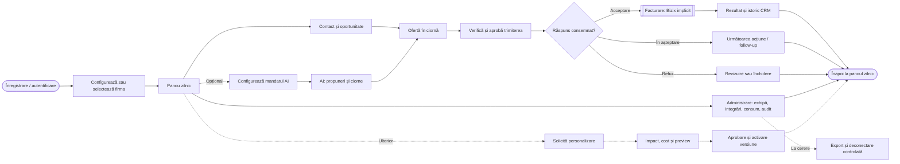

# S06 — Spațiul de lucru și UX: prima hartă B2B

> **Versiune:** 0.4 — cerințe pentru ciorne și facturare directă; diagramele v0.2 rămân neschimbate
> **Data:** 2026-09-14
> **Stare:** Două diagrame create în FigJam; sursele sunt păstrate mai jos. Nu reprezintă wireframe-uri, prototip interactiv, design final sau implementare.
> **Validare:** Ipoteză aleasă pentru explorare, încă nevalidată cu o firmă sau un interlocutor real.
> **Legături:** [Plan general](../README.md) · [Mini-brief S01](./01_PRODUS_ECONOMIE_PILOT.md)

**Board:** [Bizix — Hartă UX B2B](https://www.figma.com/board/8eaisIfYFnggwsgt0ME29P)

Pe board, vederea globală este în stânga, iar detaliul fluxului pilot în dreapta. Sunt două niveluri de descriere a aceleiași experiențe, nu două procese care trebuie executate consecutiv. Fișierul FigJam și sursele din repository trebuie actualizate împreună la revizuiri; nu există sincronizare automată configurată.

## 1. Baza și limitele hărții

Ipoteza de lucru agreată este o firmă mică de servicii B2B. Procesul ales este vânzare până la facturare, iar primul rol AI este asistent comercial. Bizix este încă în dezvoltare internă și nu există o firmă pilot identificată.

**Facturarea nativă Bizix este capabilitatea principală și implicită a produsului țintă.** FGO și alte platforme sunt integrări complet opționale pentru firmele care au nevoie să păstreze un program existent. Scopul este adoptarea în timp a facturării Bizix prin valoare, fără migrare forțată.

Fluxul nativ nu trebuie să necesite cont, credențiale sau apeluri FGO. „Implicit” descrie direcția UX, nu confirmă existența unei implementări de producție. Minimul funcțional și cerințele fiscale se stabilesc în S07. Nu au fost emise facturi, trimise oferte ori executate alte operațiuni comerciale reale.

- **UX-G01 — Vedere globală:** acces la firmă, activitate zilnică, AI, administrare, portabilitate și o ramură ulterioară de personalizare.
- **UX-P01 — Flux pilot:** ofertă, verificare umană, acceptare consemnată, facturare Bizix implicită, ramură externă opțională și tratarea excepțiilor.
- **În afara acestei versiuni:** poziționarea elementelor în pagină, componente UI definitive, toate fluxurile administrative și implementarea tehnică a integrărilor.

**Cerințe confirmate la revizuirea S02 din 2026-09-14:** un tenant reprezintă o singură entitate juridică, iar un utilizator poate avea acces separat la mai multe firme; prima versiune include și facturare directă, fără oportunitate sau ofertă. Deciziile RC-001/RC-002 sunt consemnate în [S01](./01_PRODUS_ECONOMIE_PILOT.md) și [S02](./02_ARHITECTURA_CONTRACTE_DATE.md).

La detalierea capitolului 7 din S02 au fost confirmate și RC-010–RC-012: cumpărător existent sau punctual, catalog plus linii punctuale autorizate și ciorne incomplete salvabile. UX-ul trebuie să distingă salvarea de pregătirea pentru aprobare, să afișeze lipsurile fără totaluri inventate și să prezinte snapshot-ul exact supus aprobării. Salvarea în CRM sau catalog este separată și explicită, nu un efect ascuns al facturării. Forma ecranelor și interacțiunilor rămâne de proiectat.

Această revizie documentează cerințele noi, nu modifică diagramele sau board-ul. UX-G01 și UX-P01 păstrează traseul din ofertă al versiunii 0.2. Intrarea prin facturare directă trebuie proiectată separat și legată de aceleași aprobări și stări de emitere/reconciliere, fără acceptare fictivă a unei oferte. Harta curentă nu reprezintă încă întregul scope confirmat al facturării.

Personalizarea este inclusă pe harta globală ca direcție ulterioară. Nu devine prin aceasta o cerință a primului pilot comercial. Catalogul public și distribuirea personalizărilor necesită fluxuri distincte în S12/S13.

## 2. Actori și interpretare

| Actor sau concept | Rol în hartă |
|---|---|
| Firma B2B | Compania care folosește Bizix, adică tenantul |
| Antreprenor / responsabil comercial | Gestionează contactele, oportunitățile și ofertele în limitele drepturilor sale |
| Persoana autorizată să aprobe facturarea | Verifică intenția de facturare; poate fi aceeași persoană ca responsabilul comercial |
| Asistentul comercial AI | Pregătește propuneri și ciorne din datele autorizate; nu își acordă singur drepturi |
| Clientul comercial al firmei | Destinatarul ofertei și facturii; nu este confundat cu firma care cumpără Bizix |
| Sistemul de facturare ales | Bizix implicit, extern numai opțional; sursa documentului emis și a rezultatului raportat |

Reguli de citire:

- Dreptunghiurile reprezintă pași sau zone de lucru; romburile reprezintă decizii.
- Blocul de facturare din UX-G01 este detaliat în UX-P01. Ramura principală este Bizix; ramura externă este punctată și explicit opțională.
- „Sistem ales pentru firmă” reprezintă configurația aprobată a firmei, păstrată pentru intenția de facturare. Nu este o alegere arbitrară a AI-ului la fiecare execuție.
- Legăturile punctate au etichete pentru ramuri opționale, la cerere sau ulterioare.
- „Înapoi la panoul zilnic” este același spațiu de lucru, repetat grafic pentru a evita legături lungi înapoi. Nu este un ecran suplimentar.
- O ramură care se termină într-o acțiune de corectare sau așteptare nu abandonează cazul. Utilizatorul revine la ciorna ori sarcina relevantă; tranzițiile de reluare se detaliază în wireframe-uri și S08.
- Toate acțiunile presupun contextul firmei și drepturi verificate. Faptul că o săgeată există în hartă nu acordă autorizare.

## 3. UX-G01 — Harta globală

Sursa logică actuală a primei diagrame, corectată în același board pentru facturare Bizix implicită:

Harta combină navigarea între zone și etapele procesului. Nu impune parcurgerea tuturor ramurilor la fiecare autentificare. Activarea AI este opțională; fluxul comercial trebuie să funcționeze și manual.

## 4. UX-P01 — Vânzare până la facturare

Sursa logică actuală a celei de-a doua diagrame. Versiunea 0.2 a fost actualizată în același board, fără crearea unei diagrame paralele:

```mermaid
flowchart LR
    opportunity(["Oportunitate"]) --> draft["Ofertă în ciornă: om sau AI"]
    draft --> review{"Omul aprobă oferta?"}
    review -->|"Nu"| correctQuote["Corectează ciorna"]
    review -->|"Da"| sendQuote["Trimite oferta aprobată"]
    sendQuote --> response{"Răspuns consemnat?"}
    response -->|"În așteptare"| followup["Următoarea acțiune / follow-up"]
    response -->|"Refuz"| reviseClose["Revizuiește sau închide oportunitatea"]
    response -->|"Acceptare"| invoiceIntent["Pregătește intenția de facturare"]
    invoiceIntent --> invoiceSystem{"Sistem ales pentru firmă"}
    invoiceSystem -->|"Bizix (implicit)"| nativeBilling["Facturare Bizix"]
    invoiceSystem -.->|"Extern (opțional)"| externalBilling["Integrare opțională (ex. FGO)"]
    nativeBilling --> connected{"Facturare pregătită?"}
    externalBilling --> connected
    connected -->|"Nu"| setupConnection["Configurează sistemul ales; fără emitere"]
    connected -->|"Da"| approveInvoice{"Omul aprobă emiterea?"}
    approveInvoice -->|"Nu"| noIssue["Nu se emite factura"]
    approveInvoice -->|"Da"| requestInvoice["Solicită emiterea în sistemul ales"]
    requestInvoice --> outcome{"Rezultatul emiterii?"}
    outcome -->|"Emitere confirmată"| issued(["Document și istoric CRM"])
    outcome -->|"Eșec confirmat"| correctInvoice["Corectează și cere reaprobare"]
    outcome -->|"Timeout / neclar"| unknown["Rezultat necunoscut: fără reemitere"]
    unknown --> reconcile["Verificare / reconciliere"]
    reconcile --> reconciled{"Ce este confirmat?"}
    reconciled -->|"Factura există"| issued
    reconciled -->|"Nu s-a executat"| controlledRetry["Reluare controlată, cu aprobare"]
    reconciled -->|"Încă neclar"| manualReview["Intervenție umană; păstrează așteptarea"]
```

Reguli care însoțesc diagrama:

1. „Omul aprobă” înseamnă persoana cu drepturile necesare, nu orice utilizator al firmei.
2. Acceptarea ofertei se consemnează pe baza unei confirmări reale. AI-ul nu o presupune și nu o deduce doar din lipsa unui răspuns.
3. Trimiterea ofertei nu este identică cu livrarea sau citirea mesajului. Problemele de transport au status explicit și nu permit retrimitere oarbă.
4. Aprobarea emiterii privește datele, destinatarul, sumele și sistemul concret. Schimbările relevante cer reaprobare, iar drepturile sunt reverificate la execuție.
5. Facturarea trebuie pregătită în sistemul ales: configurare validă în Bizix sau conexiune autorizată pentru opțiunea externă. Indisponibilitatea nu mută automat emiterea între Bizix și un furnizor extern.
6. „Eșec confirmat” înseamnă că neexecutarea este cunoscută. Un timeout sau un răspuns ambiguu intră în „rezultat necunoscut”.
7. „Reluare controlată” privește aceeași intenție comercială, numai după confirmarea neexecuției, cu verificarea datelor, drepturilor și aprobării. Mecanismele tehnice se validează în S08/S09; harta nu promite execuție exact o dată.
8. Documentul, nativ sau extern, se prezintă ca emis numai după confirmare. Istoricul păstrează și așteptările, erorile și reconcilierea.
9. Trecerea către facturarea Bizix este explicită și controlată pentru documente noi. Facturile istorice nu sunt reemise sau redenumite ca fiind emise de Bizix; își păstrează proveniența și identificatorii.

## 5. Zone candidate pentru wireframe-uri

Acesta este un inventar inițial, nu o listă definitivă de pagini implementate. O zonă poate deveni pagină, panou sau modal, după testarea navigării.

| ID de lucru | Zonă | Ce trebuie să clarifice |
|---|---|---|
| SCR-01 | Acces și configurarea firmei | Firma activă, rolul, configurarea inițială și accesul colegilor |
| SCR-02 | Panou zilnic | Următoarele acțiuni, oportunități, aprobări și starea activității AI |
| SCR-03 | Contact și oportunitate | Datele relevante, istoricul și următoarea acțiune comercială |
| SCR-04 | Ofertă | Ciorna, versiunea, sursa propunerii, verificarea și răspunsul consemnat |
| SCR-05 | Action Center | Cine cere ce acțiune, efectele, datele aprobate, refuzul și motivul |
| SCR-06 | Configurare facturare și integrări opționale | Bizix implicit, configurația firmei și alternativa externă numai la cerere; drepturi, stare și remediere |
| SCR-07 | Factură și rezultat | În așteptare, confirmat, eșuat sau necunoscut; document și proveniență dacă există |
| SCR-08 | Angajat AI | Mandat, responsabil uman, permisiuni, buget și activitatea efectuată |

Administrarea consumului, exportul și personalizarea sunt vizibile în harta globală, dar fluxurile lor detaliate nu sunt definite prin acest inventar.

## 6. Stări și excepții de păstrat în proiectarea ecranelor

| Situație | Comportament UX de proiectat |
|---|---|
| Nu există încă date | Explicăm următorul pas; nu afișăm metrici fictive ca activitate reală |
| Lipsesc informații pentru ofertă/factură | Ciornă și cerere de completare, fără executarea efectului extern |
| Utilizatorul nu are drepturi | Acțiune blocată, explicație și cale de solicitare a accesului potrivit |
| Așteptăm aprobarea sau răspunsul clientului comercial | Status clar, responsabil și următoarea acțiune; nu avansăm implicit |
| Propunere respinsă | Motiv și revenire la corectare ori închidere, fără efectul respins |
| Sistemul de facturare ales indisponibil | Emiterea afectată așteaptă, fără schimbarea automată a furnizorului; CRM-ul rămâne utilizabil |
| FGO neconectat, firma folosește Bizix | Facturarea nativă nu este blocată și nu solicită un cont FGO |
| Rezultat necunoscut la emitere | Afișăm verificarea/reconcilierea, nu un buton de reemitere necontrolată |
| AI indisponibil sau buget epuizat | Lucrul manual rămâne disponibil; sarcina poate fi preluată de om |
| Date schimbate după aprobare | Revalidare și, unde este necesar, reaprobare |

Harta nu reprezintă încă toate excepțiile de autentificare, comunicare sau administrare. Tabelul este o intrare pentru wireframe-uri și contracte, nu dovada că aceste comportamente sunt implementate.

## 7. Verificare și pasul următor

Verificări consemnate pentru diagramele versiunii 0.2, nemodificate prin această revizie documentară:

- Diagramele sunt păstrate în același board. Versiunea 0.2 actualizează etichetele și introduce ramura Bizix implicit / extern opțional, fără ștergerea diagramelor existente.
- Verificarea structurală urmărește alegerea sistemului, aprobările, rezultatele necunoscute și reconcilierea. Ramura externă este punctată și nu este un fallback automat.
- Sursele Mermaid descriu structura logică actuală, pentru revizuire și regenerare controlată.

Nu au fost făcute teste de utilizabilitate cu clienți, validări de backend sau apeluri comerciale reale. Generarea diagramei nu validează automat produsul sau integrarea FGO.

Pentru următoarea discuție verificăm:

1. Sunt clare diferența dintre firma care folosește Bizix și clientul său comercial, rolurile și responsabilitățile?
2. Unde ar căuta utilizatorul următoarea acțiune și aprobările?
3. Înțelege exact ce pregătește AI-ul și ce nu execută singur?
4. Ce vede și ce poate face când facturarea nu răspunde?
5. Ce pași sau informații lipsesc din activitatea unei firme reale?
6. Cum intră utilizatorul în facturarea directă, fără oportunitate/ofertă, și cum ajunge la aceleași validări, aprobări și rezultate?
7. Este clară firma activă când utilizatorul are acces la mai mulți tenants cu date și drepturi separate?

După revizuirea hărții, proiectăm intrarea prin facturare directă și pregătim wireframe-uri schematice pentru ambele trasee. Revenim asupra S01/S02 cu observațiile rezultate. Prototipul clicabil și designul final rămân livrabile ulterioare, nu rezultate ale acestei etape.
